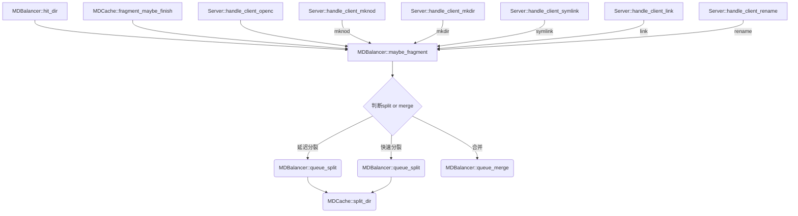

---
写作年份:
  - "2026"
imageNameKey: 元数据分区
tags:
  - cephfs
  - mds
---
```c++
//include/cephfs/types.h
typedef int32_t mds_rank_t;
constexpr mds_rank_t MDS_RANK_NONE		= -1;
constexpr mds_rank_t MDS_RANK_EPHEMERAL_DIST	= -2;
constexpr mds_rank_t MDS_RANK_EPHEMERAL_RAND	= -3;
```
# 1 目录分片
在 CephFS 中，当一个目录包含大量文件（例如超过默认的 10,000 个）时，MDS（元数据服务器）会将其**分裂成多个分片**，每个分片对应一个独立的元数据对象，可以分布存储甚至由不同的 MDS 服务，从而避免单个目录成为性能瓶颈

工作原理：动态分裂与合并[^1]
1. **分裂 (Split)**：当一个目录分片的大小超过阈值（如 10,000 个条目）或访问非常频繁（如每秒上万次操作）时，MDS 会将其分裂成更多的小分片（如 2、4 或 8 个），并更新 `fragtree_t` 来记录这一变化。当 MDS 识别一个目录碎片需要被分割时，它不会立即进行分割。因为分割会中断元数据 IO，所以使用一个短延迟来允许客户端 IO 的短爆发完成后再开始分割。这个延迟通过 `mds_bal_fragment_interval` 配置，默认值为 5 秒。
2. **合并 (Merge)**：当一个分片因文件删除等原因变得很小（如少于 50 个条目）时，MDS 会将其与相邻分片合并，以节省资源，同时也会更新 `fragtree_t`

> 可以使用 ceph daemon mds.<mds_id> dump cache [/path/to/directory] 观察一个缓存中目录的分片信息  
> 

存储格式： 每个分片独立存储在元数据池的一个 RADOS 对象中：`<inode>.<frag_id>`
## 1.1 分裂策略  
>  延迟分裂（默认 5 秒）+ 紧急快速分裂  

### 1.1.1 影响因子
MDS 根据**大小阈值**和**活动阈值**两个维度判断是否需要分裂  
1. 大小阈值

| 配置项                          | 默认值    | 说明                                    |
|------------------------------|--------|---------------------------------------|
| mds_bal_split_size           | 10000  | 分片条目数超过此值时触发分裂（可延迟）                   |
| mds_bal_fragment_fast_factor | —      | 超过 split_size × fast_factor 时立即分裂，无延迟 |
| mds_bal_fragment_size_max    | 100000 | 硬上限，达到后客户端收到 ENOSPC，阻止新文件创建            |
| mds_bal_merge_size           | 50     | 分片条目数低于此值时触发合并                        |
2. 活动阈值  
基于时间衰减的负载计数器（半衰期由 `mds_decay_halflife` 控制）：

| 配置项                | 默认值   | 说明                                    |
| ------------------ | ----- | ------------------------------------- |
| `mds_bal_split_wr` | 10000 | 写操作负载（create、unlink、rename 等）超过阈值触发分裂[^2] |
| `mds_bal_split_rd` | 25000 | 读操作负载（readdir）超过阈值触发分裂[^3]            |

> 注意：因活动阈值而分裂的分片，后续**只能基于大小阈值合并**，活动热度下降不会触发合并。  
> 
## 1.2 分裂过程描述  
分片不是即时执行的，MDS 采用**延迟+快速**两种策略。  
函数入口： MDBalancer::maybe_fragment()  


### 1.2.1 分裂算法  

### 1.2.2 延迟分裂（默认行为）  
CDir::should_split()  

### 1.2.3 快速分裂（紧急情况）  
CDir::should_split_fast()  

## 1.3 合并策略  
仅基于大小阈值（默认<50 条目）  

## 1.4 负载均衡  
分片可在多 MDS 间动态迁移  

## 1.5 高级策略：静态/动态混合分区  

Ceph 20.0.2 在动态分片的基础上，引入了更精细的控制策略，允许管理员在动态均衡和静态绑定之间取得平衡。

| 策略        | 属性名                        | 作用                                      |
| --------- | -------------------------- | --------------------------------------- |
| **导出引脚**  | `ceph.dir.pin`             | 强制将整个子树绑定到指定的 MDS，类似固定分区。               |
| **分布式引脚** | `ceph.dir.pin.distributed` | 立即将目录下的直接子项打散到集群所有 MDS。非常适合 `/home` 目录。 |
| **随机引脚**  | `ceph.dir.pin.random`      | 按概率随机将子目录自动分配到各 MDS，适用于临时目录。            |
此外，新版本还支持通过 `bal_rank_mask` 参数指定哪些 MDS Rank 参与动态均衡，防止静态绑定的高负载业务被自动均衡策略干扰。  

## 1.6 数据结构描述

```c++
// include/frag.h
/* Ceph内部使用frag_t结构来描述分片
格式：目录inode号.分片值，例如 1000000000c.09640000
逻辑：将目录项（文件名）通过哈希运算，映射到对应的分片
a) bits (高8位)：决定分片的数量（2^bits个分片）。若bits=3，则哈希空间被分为8段
b) value (低24位)：当前分片所代表的哈希值范围

1. 使用 (bits, value)对标识一个分片
2. bits表示分片深度，决定了分片数量：分片数 = 2^bits
3. 默认分裂时 bits 增加 mds_bal_split_bits（默认3），即一次分裂创建8个新分片
*/

class frag_t { //分片单元
public:
    using _frag_t = uint32_t;

private:
    _frag_t _enc = 0;
}

/*记录的就是这些分片之间的关系
1. 记录分裂关系: 它本质上是一个映射表（compact_map<frag_t,int32_t>），记录哪些分片是“父节点”，以及它被分成了几个子分片。对于从未分裂过的小目录，这个结构通常是空的
2. 快速定位：给定一个文件名，CephFS 可以通过其哈希值，利用 fragtree_t 快速计算出这个文件具体属于哪个分片（即 frag_t）
3. 这个“分片地图”是目录 inode 元数据的一部分。当 MDS 将目录信息写入底层的元数据存储池时，fragtree_t 会连同其他属性（如 xattrs）一起被序列化并持久化保存
*/
class fragtree_t {
public:
    compact_map<frag_t,int32_t> _splits;
}

// mds/mdstypes.h
struct dirfrag_t {
    inodeno_t ino = 0;
    frag_t frag;
};
```
# 2 inode 分配机制
Inode 分配机制是一个**全局唯一、由 MDS 集中分配并持久化到 RADOS** 的过程。
## 2.1 inode 结构  
在 CephFS 中，每个文件和目录都对应一个唯一的 Inode。它本质上是一个包含文件所有元数据的核心数据结构，但**不包含文件名**  
Inode 编号是一个 **64 位全局唯一标识符**，其生成机制保证了即使在多 MDS 环境下，每个 Inode 的编号也绝不会重复。  
1. **集中分配**：MDS 作为权威分配者，负责生成所有新的 Inode 编号  
2. **预分片策略**：每个 MDS 会预先从元数据池中申请一大段编号区间（例如 1~1,000,000 给 MDS A，1,000,001~2,000,000 给 MDS B）。这种策略避免了各 MDS 之间频繁协调，显著提升了高并发下的分配性能。  
3. **持久化存储**：MDS 将当前已分配的编号范围作为元数据保存在 RADOS 的对象中。即使 MDS 重启，也能从持久化存储中恢复分配进度，确保不会重复分配。  