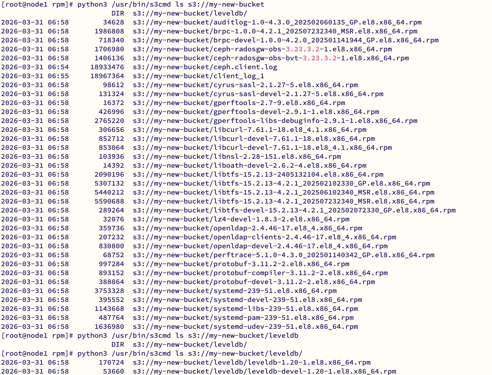
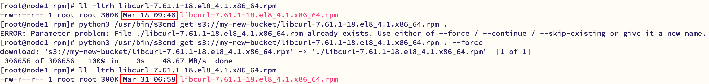
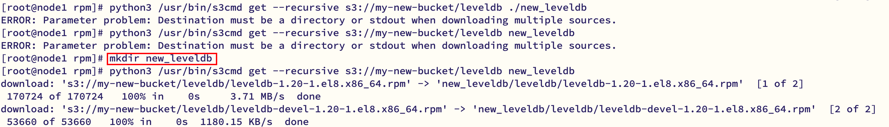

安装 s3cmd  
```bash
yum -y install s3cmd

python3 /usr/bin/s3cmd --configure

# Access Key和Secret Key创建用户时的回显
# S3 Endpoint和DNS-style bucket+hostname使用rgw监听的HTTP端口，其余的默认
New settings:
  Access Key: KF8LPEA54DGT9SMI2KUY
  Secret Key: WqUjZDnOYtEJew6ViW4TnvzmqeGnlyg9UQ6nbwvC
  Default Region: US
  S3 Endpoint: 10.128.133.42:8184
  DNS-style bucket+hostname:port template for accessing a bucket: 10.128.133.42:8184/%(bucket)
  Encryption password: 
  Path to GPG program: /bin/gpg
  Use HTTPS protocol: False
  HTTP Proxy server name: 
  HTTP Proxy server port: 0
```

| 参数                        | 说明       | 示例值                                                      |
|---------------------------|----------|----------------------------------------------------------|
| Access Key                | 用户的访问密钥  | 从 radosgw-admin user info --uid=4001 获取                  |
| Secret Key                | 用户的秘密密钥  | 从 radosgw-admin user info --uid=4001 获取                  |
| Default Region            | 默认区域     | 通常留空或填 US                                                |
| S3 Endpoint               | RGW 服务地址 | node1:7480 或你的RGW主机IP                                    |
| DNS-style bucket+hostname | DNS风格桶名  | 通常选 %(bucket).s3.amazonaws.com 或直接填 %(bucket).node1:7480 |
| Encryption password       | 加密密码     | 通常留空                                                     |
| Path to GPG program       | GPG程序路径  | 通常留空或填 /usr/bin/gpg                                      |
| Use HTTPS protocol        | 使用HTTPS  | 通常选 False（如果没配置SSL）                                      |
| HTTP Proxy server name    | HTTP代理   | 通常留空                                                     |

# 1 桶相关  
## 1.1 创建桶  
```bash
[root@node1 ~]# python3 /usr/bin/s3cmd mb s3://my-new-bucket
Bucket 's3://my-new-bucket/' created
```

检查桶是否创建成功：  
```bash
[root@node1 ~]# radosgw-admin bucket list
[
    "my-new-bucket"
]
[root@node1 ~]# radosgw-admin bucket stats --bucket=my-new-bucket
{
    "bucket": "my-new-bucket",
    "num_shards": 1027,
    "tenant": "",
    "zonegroup": "14ebae29-9348-44fc-84ae-e9174054083b",
    "placement_rule": "policy1/",
```
## 1.2 查询  
1. 查询所有桶
```bash
[root@node1 ~]# python3 /usr/bin/s3cmd ls
2026-03-31 06:44  s3://my-new-bucket
```

2. 查询某个桶里的文件
```bash
[root@node1 ~]# python3 /usr/bin/s3cmd ls s3://my-new-bucket
2026-03-31 06:54     18933476  s3://my-new-bucket/ceph.client.log
```

3. 查询桶的详细信息
```bash
[root@node1 ~]# python3 /usr/bin/s3cmd  info s3://my-new-bucket
s3://my-new-bucket/ (bucket):
   Location:  magnascale:policy1
   Payer:     BucketOwner
   Expiration Rule: none
   Policy:    none
   CORS:      none
   ACL:       user1: FULL_CONTROL
```

## 1.3 删除桶  
1. 删除空桶
```bash
[root@node1 rpm]# radosgw-admin bucket rm --bucket=my-new-bucket
2026-03-31T15:12:18.880+0800 7f9910d20a80 -1 bucket.cc. rgw_remove_bucket: 376 ERROR: could not remove non-empty bucket my-new-bucket
2026-03-31T15:12:18.881+0800 7f9910d20a80 -1 bucket.cc. remove_bucket: 1435 ERROR: unable to remove bucket(39) Directory not empty
```
2. 删除带数据的桶
```bash
# 使用--purge-objects
[root@node1 rpm]# radosgw-admin bucket rm --bucket=my-new-bucket --purge-objects
[root@node1 rpm]# python3 /usr/bin/s3cmd ls s3://my-new-bucket
ERROR: Bucket 'my-new-bucket' does not exist
ERROR: S3 error: 404 (NoSuchBucket)
```
## 1.4 问题汇总  
1. 创建桶时：`ERROR: [Errno -2] Name or service not known`
```bash
[root@node1 ~]# python3 /usr/bin/s3cmd mb s3://my-new-bucket
ERROR: [Errno -2] Name or service not known
ERROR: Connection Error: Error resolving a server hostname.
Please check the servers address specified in 'host_base', 'host_bucket', 'cloudfront_host', 'website_endpoint'
```
原因：host_bucket = %(bucket)s.10.128.133.42:8184，这会导致 s3cmd 尝试解析类似 `my-new-bucket.10.128.133.42:8184` 的域名，所以会失败
修改 host_base 和 host_bucket  为
```bash
host_base = 10.128.133.42:8184
host_bucket = 10.128.133.42:8184/%(bucket)
```

2. 创建桶时：S3 error: 400 (ZonegroupDefaultPlacementMisconfiguration)
原因：在创建桶时没有指定正确的存储策略（placement target） ,`default_placement` 设置为 `"/"`（无效值）
```bash
"placement_targets": [
    {
        "name": "policy1",
        "tags": [],
        "storage_classes": [
            "STANDARD"
        ]
    }
],
"default_placement": "/",
```
方案一：使用默认存储策略：`default_placement`  
如果你的环境中没有 `default-placement`，可以先查看一下现有的策略  
```bash
# 查看当前的区域组配置，找到可用的 placement targets
radosgw-admin zonegroup get
```

从输出中找到 `placement_targets` 部分，例如：  
```bash
"placement_targets": [
    {
        "name": "policy1",
        "tags": [],
        "storage_classes": [
            "STANDARD"
        ]
    }
],
```

设置默认存储策略  
```bash
radosgw-admin zonegroup placement default --placement-id "policy1"
```

修改完后：  
```bash
[root@node1 ~]# radosgw-admin zonegroup get | grep -A 2 default_placement
    "default_placement": "policy1/",
    "realm_id": "6c86164e-8639-4c74-8417-8910da035a62",
    "sync_policy": {
```

更新周期并重启服务  
```bash
# 更新周期
radosgw-admin period update --commit

# 重启 RGW 服务
systemctl restart ceph-radosgw@rgw.tosa.service
```

  


# 2 对象相关  
## 2.1 上传命令  
1. 上传单个文件
```bash
[root@node1 ~]# python3 /usr/bin/s3cmd put /var/log/ceph/ceph.client.log s3://my-new-bucket/
upload: '/var/log/ceph/ceph.client.log' -> 's3://my-new-bucket/ceph.client.log'  [part 1 of 2, 15MB] [1 of 1]
 15728640 of 15728640   100% in    0s    79.84 MB/s  done
upload: '/var/log/ceph/ceph.client.log' -> 's3://my-new-bucket/ceph.client.log'  [part 2 of 2, 3MB] [1 of 1]
 3204836 of 3204836   100% in    0s    30.66 MB/s  done
```
2. 上传并且重命名
```bash
[root@node1 ~]# python3 /usr/bin/s3cmd put /var/log/ceph/ceph.client.log s3://my-new-bucket/client_log_1
upload: '/var/log/ceph/ceph.client.log' -> 's3://my-new-bucket/client_log_1'  [part 1 of 2, 15MB] [1 of 1]
 15728640 of 15728640   100% in    0s    66.83 MB/s  done
upload: '/var/log/ceph/ceph.client.log' -> 's3://my-new-bucket/client_log_1'  [part 2 of 2, 3MB] [1 of 1]
 3238724 of 3238724   100% in    0s    35.63 MB/s  done
```

3. 上传整个文件夹（遍历）
```bash
# 文件夹内容
[root@node1 rpm]# ls
auditlog-1.0-4.3.0_202502060135_GP.el8.x86_64.rpm      libcurl-devel-7.61.1-18.el8_4.1.x86_64.rpm                 openldap-devel-2.4.46-17.el8_4.x86_64.rpm
brpc-1.0.0-4.2.1_202507232340_MSR.el8.x86_64.rpm       libcurl-devel-7.61.1-18.el8.x86_64.rpm                     perftrace-5.1.0-4.3.0_202501140342_GP.el8.x86_64.rpm
brpc-devel-1.0.0-4.2.0_202501141944_GP.el8.x86_64.rpm  libnsl-2.28-151.el8.x86_64.rpm                             protobuf-3.11.2-2.el8.x86_64.rpm
ceph-radosgw-obs-3.23.3.2-1.el8.x86_64.rpm             liboath-devel-2.6.2-4.el8.x86_64.rpm                       protobuf-compiler-3.11.2-2.el8.x86_64.rpm
ceph-radosgw-obs-bvt-3.23.3.2-1.el8.x86_64.rpm         libtfs-15.2.13-2405132104.el8.x86_64.rpm                   protobuf-devel-3.11.2-2.el8.x86_64.rpm
cyrus-sasl-2.1.27-5.el8.x86_64.rpm                     libtfs-15.2.13-4.2.1_202502102330_GP.el8.x86_64.rpm        systemd-239-51.el8.x86_64.rpm
cyrus-sasl-devel-2.1.27-5.el8.x86_64.rpm               libtfs-15.2.13-4.2.1_202506102340_MSR.el8.x86_64.rpm       systemd-devel-239-51.el8.x86_64.rpm
gperftools-2.7-9.el8.x86_64.rpm                        libtfs-15.2.13-4.2.1_202507232340_MSR.el8.x86_64.rpm       systemd-libs-239-51.el8.x86_64.rpm
gperftools-devel-2.9.1-1.el8.x86_64.rpm                libtfs-devel-15.2.13-4.2.1_202502072330_GP.el8.x86_64.rpm  systemd-pam-239-51.el8.x86_64.rpm
gperftools-libs-debuginfo-2.9.1-1.el8.x86_64.rpm       lz4-devel-1.8.3-2.el8.x86_64.rpm                           systemd-udev-239-51.el8.x86_64.rpm
leveldb                                                openldap-2.4.46-17.el8_4.x86_64.rpm
libcurl-7.61.1-18.el8_4.1.x86_64.rpm                   openldap-clients-2.4.46-17.el8_4.x86_64.rpm

# 上传操作
[root@node1 rpm]# python3 /usr/bin/s3cmd put --recursive /home/rpm/ s3://my-new-bucket
upload: '/home/rpm/auditlog-1.0-4.3.0_202502060135_GP.el8.x86_64.rpm' -> 's3://my-new-bucket/auditlog-1.0-4.3.0_202502060135_GP.el8.x86_64.rpm'  [1 of 35]
 34628 of 34628   100% in    0s   754.43 KB/s  done
upload: '/home/rpm/brpc-1.0.0-4.2.1_202507232340_MSR.el8.x86_64.rpm' -> 's3://my-new-bucket/brpc-1.0.0-4.2.1_202507232340_MSR.el8.x86_64.rpm'  [2 of 35]
 1986808 of 1986808   100% in    0s    22.74 MB/s  done
upload: '/home/rpm/brpc-devel-1.0.0-4.2.0_202501141944_GP.el8.x86_64.rpm' -> 's3://my-new-bucket/brpc-devel-1.0.0-4.2.0_202501141944_GP.el8.x86_64.rpm'  [3 of 35]
 718340 of 718340   100% in    0s    16.82 MB/s  done
upload: '/home/rpm/ceph-radosgw-obs-3.23.3.2-1.el8.x86_64.rpm' -> 's3://my-new-bucket/ceph-radosgw-obs-3.23.3.2-1.el8.x86_64.rpm'  [4 of 35]
 1706980 of 1706980   100% in    0s    29.54 MB/s  done
upload: '/home/rpm/ceph-radosgw-obs-bvt-3.23.3.2-1.el8.x86_64.rpm' -> 's3://my-new-bucket/ceph-radosgw-obs-bvt-3.23.3.2-1.el8.x86_64.rpm'  [5 of 35]
```
结果（保持了目录结构）
  

## 2.2 下载命令  
1. 下载单个文件
```bash
[root@node1 rpm]# python3 /usr/bin/s3cmd get s3://my-new-bucket/libcurl-7.61.1-18.el8_4.1.x86_64.rpm .
ERROR: Parameter problem: File ./libcurl-7.61.1-18.el8_4.1.x86_64.rpm already exists. Use either of --force / --continue / --skip-existing or give it a new name.
```

  

2. 下载整个文件夹
```bash
python3 /usr/bin/s3cmd get --recursive s3://my-new-bucket/leveldb new_leveldb
```
注意：需要目标文件夹存在
   
## 2.3 删除命令  
1. 删除单个文件
```bash
[root@node1 rpm]# python3 /usr/bin/s3cmd del s3://my-new-bucket/lz4-devel-1.8.3-2.el8.x86_64.rpm
delete: 's3://my-new-bucket/lz4-devel-1.8.3-2.el8.x86_64.rpm'

# 不能删除文件夹
[root@node1 rpm]# python3 /usr/bin/s3cmd del s3://my-new-bucket/leveldb
delete: 's3://my-new-bucket/leveldb'
[root@node1 rpm]# python3 /usr/bin/s3cmd ls s3://my-new-bucket
                          DIR  s3://my-new-bucket/leveldb/
2026-03-31 06:58        34628  s3://my-new-bucket/auditlog-1.0-4.3.0_202502060135_GP.el8.x86_64.rpm

[root@node1 rpm]# python3 /usr/bin/s3cmd ls s3://my-new-bucket/leveldb/
2026-03-31 06:58       170724  s3://my-new-bucket/leveldb/leveldb-1.20-1.el8.x86_64.rpm
2026-03-31 06:58        53660  s3://my-new-bucket/leveldb/leveldb-devel-1.20-1.el8.x86_64.rpm
```

2. 递归删除文件夹
```bash
# 使用--recursive
[root@node1 rpm]# python3 /usr/bin/s3cmd del --recursive s3://my-new-bucket/leveldb
delete: 's3://my-new-bucket/leveldb/leveldb-1.20-1.el8.x86_64.rpm'
delete: 's3://my-new-bucket/leveldb/leveldb-devel-1.20-1.el8.x86_64.rpm'
[root@node1 rpm]# python3 /usr/bin/s3cmd ls s3://my-new-bucket/leveldb
[root@node1 rpm]# python3 /usr/bin/s3cmd del --recursive s3://my-new-bucket
ERROR: Parameter problem: Please use --force to delete ALL contents of s3://my-new-bucket
[root@node1 rpm]# python3 /usr/bin/s3cmd ls s3://my-new-bucket/leveldb
[root@node1 rpm]# python3 /usr/bin/s3cmd ls s3://my-new-bucket
2026-03-31 06:58        34628  s3://my-new-bucket/auditlog-1.0-4.3.0_202502060135_GP.el8.x86_64.rpm
```

3. 清空桶里所有文件
```bash
# 使用--recursive --force
[root@node1 rpm]# python3 /usr/bin/s3cmd del --recursive --force s3://my-new-bucket
delete: 's3://my-new-bucket/auditlog-1.0-4.3.0_202502060135_GP.el8.x86_64.rpm'
.....
delete: 's3://my-new-bucket/systemd-pam-239-51.el8.x86_64.rpm'
delete: 's3://my-new-bucket/systemd-udev-239-51.el8.x86_64.rpm'
[root@node1 rpm]# python3 /usr/bin/s3cmd ls s3://my-new-bucket
```