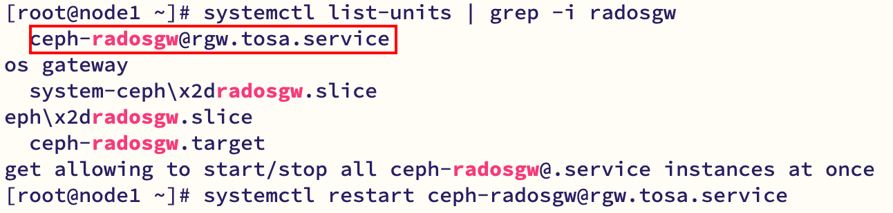

`s3cmd` 是一款流行的命令行工具，用于与 S3 兼容的对象存储（包括 Ceph RGW）进行交互。  
要让 `s3cmd` 连接到你的 Ceph RGW，需要正确配置 `~/.s3cfg` 文件。RGW 的 S3 接口通常默认监听 7480 端口。  
`s3cmd` 执行的是标准的 S3 API 操作，主要用于数据面的存取。  
`radosgw-admin` 执行的是管理员操作，主要用于元数据查看和系统配置。   
**安装 s3cmd**  ：
```bash
yum -y install s3cmd

python3 /usr/bin/s3cmd --configure

# Access Key和Secret Key创建用户时的回显
# S3 Endpoint和DNS-style bucket+hostname使用rgw监听的HTTP端口，其余的默认
New settings:
  Access Key: KF8LPEA54DGT9SMI2KUY
  Secret Key: WqUjZDnOYtEJew6ViW4TnvzmqeGnlyg9UQ6nbwvC
  Default Region: US
  S3 Endpoint: 10.128.133.42:8184
  DNS-style bucket+hostname:port template for accessing a bucket: 10.128.133.42:8184/%(bucket)
  Encryption password: 
  Path to GPG program: /bin/gpg
  Use HTTPS protocol: False
  HTTP Proxy server name: 
  HTTP Proxy server port: 0
```

| 参数                        | 说明       | 示例值                                                      |
|---------------------------|----------|----------------------------------------------------------|
| Access Key                | 用户的访问密钥  | 从 radosgw-admin user info --uid=4001 获取                  |
| Secret Key                | 用户的秘密密钥  | 从 radosgw-admin user info --uid=4001 获取                  |
| Default Region            | 默认区域     | 通常留空或填 US                                                |
| S3 Endpoint               | RGW 服务地址 | node1:7480 或你的RGW主机IP                                    |
| DNS-style bucket+hostname | DNS风格桶名  | 通常选 %(bucket).s3.amazonaws.com 或直接填 %(bucket).node1:7480 |
| Encryption password       | 加密密码     | 通常留空                                                     |
| Path to GPG program       | GPG程序路径  | 通常留空或填 /usr/bin/gpg                                      |
| Use HTTPS protocol        | 使用HTTPS  | 通常选 False（如果没配置SSL）                                      |
| HTTP Proxy server name    | HTTP代理   | 通常留空                                                     |

# 1 桶相关  
## 1.1 创建桶  
```bash
[root@node1 ~]# python3 /usr/bin/s3cmd mb s3://my-new-bucket
Bucket 's3://my-new-bucket/' created
```

检查桶是否创建成功：  
```bash
[root@node1 ~]# radosgw-admin bucket list
[
    "my-new-bucket"
]
[root@node1 ~]# radosgw-admin bucket stats --bucket=my-new-bucket
{
    "bucket": "my-new-bucket",
    "num_shards": 1027,
    "tenant": "",
    "zonegroup": "14ebae29-9348-44fc-84ae-e9174054083b",
    "placement_rule": "policy1/",
```
## 1.2 查询  
1. 查询所有桶
```bash
[root@node1 ~]# python3 /usr/bin/s3cmd ls
2026-03-31 06:44  s3://my-new-bucket
```

2. 查询某个桶里的文件
```bash
[root@node1 ~]# python3 /usr/bin/s3cmd ls s3://my-new-bucket
2026-03-31 06:54     18933476  s3://my-new-bucket/ceph.client.log

# 递归列出所有对象
[root@ceph-221 /]# s3cmd ls --recursive s3://my-new-bucket/
2026-04-07 12:33            6  s3://my-new-bucket/radosgw.8000.pid
```

3. 查询桶的详细信息
```bash
[root@node1 ~]# python3 /usr/bin/s3cmd  info s3://my-new-bucket
s3://my-new-bucket/ (bucket):
   Location:  rgw-scale:policy1
   Payer:     BucketOwner
   Expiration Rule: none
   Policy:    none
   CORS:      none
   ACL:       user1: FULL_CONTROL
```

## 1.3 删除桶  
1. 删除空桶
```bash
[root@node1 rpm]# radosgw-admin bucket rm --bucket=my-new-bucket
2026-03-31T15:12:18.880+0800 7f9910d20a80 -1 bucket.cc. rgw_remove_bucket: 376 ERROR: could not remove non-empty bucket my-new-bucket
2026-03-31T15:12:18.881+0800 7f9910d20a80 -1 bucket.cc. remove_bucket: 1435 ERROR: unable to remove bucket(39) Directory not empty

[root@ceph-221 /]# s3cmd rb s3://my-new-bucket
ERROR: S3 error: 409 (BucketNotEmpty)
```
2. 删除带数据的桶
```bash
# 使用--purge-objects
[root@node1 rpm]# radosgw-admin bucket rm --bucket=my-new-bucket --purge-objects
[root@node1 rpm]# python3 /usr/bin/s3cmd ls s3://my-new-bucket
ERROR: Bucket 'my-new-bucket' does not exist
ERROR: S3 error: 404 (NoSuchBucket)
```
## 1.4 问题汇总  
1. 创建桶时：`ERROR: [Errno -2] Name or service not known`
```bash
[root@node1 ~]# python3 /usr/bin/s3cmd mb s3://my-new-bucket
ERROR: [Errno -2] Name or service not known
ERROR: Connection Error: Error resolving a server hostname.
Please check the servers address specified in 'host_base', 'host_bucket', 'cloudfront_host', 'website_endpoint'
```
原因：host_bucket = %(bucket)s.10.128.133.42:8184，这会导致 s3cmd 尝试解析类似 `my-new-bucket.10.128.133.42:8184` 的域名，所以会失败
修改 host_base 和 host_bucket  为
```bash
host_base = 10.128.133.42:8184
host_bucket = 10.128.133.42:8184/%(bucket)
```

2. 创建桶时：S3 error: 400 (ZonegroupDefaultPlacementMisconfiguration)
原因：在创建桶时没有指定正确的存储策略（placement target） ,`default_placement` 设置为 `"/"`（无效值）
```bash
"placement_targets": [
    {
        "name": "policy1",
        "tags": [],
        "storage_classes": [
            "STANDARD"
        ]
    }
],
"default_placement": "/",
```
方案一：使用默认存储策略：`default_placement`  
如果你的环境中没有 `default-placement`，可以先查看一下现有的策略  
```bash
# 查看当前的区域组配置，找到可用的 placement targets
radosgw-admin zonegroup get
```

从输出中找到 `placement_targets` 部分，例如：  
```bash
"placement_targets": [
    {
        "name": "policy1",
        "tags": [],
        "storage_classes": [
            "STANDARD"
        ]
    }
],
```

设置默认存储策略  
```bash
radosgw-admin zonegroup placement default --placement-id "policy1"
```

修改完后：  
```bash
[root@node1 ~]# radosgw-admin zonegroup get | grep -A 2 default_placement
    "default_placement": "policy1/",
    "realm_id": "6c86164e-8639-4c74-8417-8910da035a62",
    "sync_policy": {
```

更新周期并重启服务  
```bash
# 更新周期
radosgw-admin period update --commit

# 重启 RGW 服务
systemctl restart ceph-radosgw@rgw.tosa.service
```

  

# 2 对象相关  
## 2.1 上传命令  
1. 上传单个文件
```bash
[root@node1 ~]# python3 /usr/bin/s3cmd put /var/log/ceph/ceph.client.log s3://my-new-bucket/
upload: '/var/log/ceph/ceph.client.log' -> 's3://my-new-bucket/ceph.client.log'  [part 1 of 2, 15MB] [1 of 1]
 15728640 of 15728640   100% in    0s    79.84 MB/s  done
upload: '/var/log/ceph/ceph.client.log' -> 's3://my-new-bucket/ceph.client.log'  [part 2 of 2, 3MB] [1 of 1]
 3204836 of 3204836   100% in    0s    30.66 MB/s  done
```
2. 上传并且重命名
```bash
[root@node1 ~]# python3 /usr/bin/s3cmd put /var/log/ceph/ceph.client.log s3://my-new-bucket/client_log_1
upload: '/var/log/ceph/ceph.client.log' -> 's3://my-new-bucket/client_log_1'  [part 1 of 2, 15MB] [1 of 1]
 15728640 of 15728640   100% in    0s    66.83 MB/s  done
upload: '/var/log/ceph/ceph.client.log' -> 's3://my-new-bucket/client_log_1'  [part 2 of 2, 3MB] [1 of 1]
 3238724 of 3238724   100% in    0s    35.63 MB/s  done
```

3. 上传整个文件夹（遍历）
```bash
# 文件夹内容
[root@node1 rpm]# ls
auditlog-1.0-4.3.0_202502060135_GP.el8.x86_64.rpm      libcurl-devel-7.61.1-18.el8_4.1.x86_64.rpm                 openldap-devel-2.4.46-17.el8_4.x86_64.rpm
brpc-1.0.0-4.2.1_202507232340_MSR.el8.x86_64.rpm       libcurl-devel-7.61.1-18.el8.x86_64.rpm                     perftrace-5.1.0-4.3.0_202501140342_GP.el8.x86_64.rpm
brpc-devel-1.0.0-4.2.0_202501141944_GP.el8.x86_64.rpm  libnsl-2.28-151.el8.x86_64.rpm                             protobuf-3.11.2-2.el8.x86_64.rpm
ceph-radosgw-obs-3.23.3.2-1.el8.x86_64.rpm             liboath-devel-2.6.2-4.el8.x86_64.rpm                       protobuf-compiler-3.11.2-2.el8.x86_64.rpm
ceph-radosgw-obs-bvt-3.23.3.2-1.el8.x86_64.rpm         libtfs-15.2.13-2405132104.el8.x86_64.rpm                   protobuf-devel-3.11.2-2.el8.x86_64.rpm
cyrus-sasl-2.1.27-5.el8.x86_64.rpm                     libtfs-15.2.13-4.2.1_202502102330_GP.el8.x86_64.rpm        systemd-239-51.el8.x86_64.rpm
cyrus-sasl-devel-2.1.27-5.el8.x86_64.rpm               libtfs-15.2.13-4.2.1_202506102340_MSR.el8.x86_64.rpm       systemd-devel-239-51.el8.x86_64.rpm
gperftools-2.7-9.el8.x86_64.rpm                        libtfs-15.2.13-4.2.1_202507232340_MSR.el8.x86_64.rpm       systemd-libs-239-51.el8.x86_64.rpm
gperftools-devel-2.9.1-1.el8.x86_64.rpm                libtfs-devel-15.2.13-4.2.1_202502072330_GP.el8.x86_64.rpm  systemd-pam-239-51.el8.x86_64.rpm
gperftools-libs-debuginfo-2.9.1-1.el8.x86_64.rpm       lz4-devel-1.8.3-2.el8.x86_64.rpm                           systemd-udev-239-51.el8.x86_64.rpm
leveldb                                                openldap-2.4.46-17.el8_4.x86_64.rpm
libcurl-7.61.1-18.el8_4.1.x86_64.rpm                   openldap-clients-2.4.46-17.el8_4.x86_64.rpm

# 上传操作
[root@node1 rpm]# python3 /usr/bin/s3cmd put --recursive /home/rpm/ s3://my-new-bucket
upload: '/home/rpm/auditlog-1.0-4.3.0_202502060135_GP.el8.x86_64.rpm' -> 's3://my-new-bucket/auditlog-1.0-4.3.0_202502060135_GP.el8.x86_64.rpm'  [1 of 35]
 34628 of 34628   100% in    0s   754.43 KB/s  done
upload: '/home/rpm/brpc-1.0.0-4.2.1_202507232340_MSR.el8.x86_64.rpm' -> 's3://my-new-bucket/brpc-1.0.0-4.2.1_202507232340_MSR.el8.x86_64.rpm'  [2 of 35]
 1986808 of 1986808   100% in    0s    22.74 MB/s  done
upload: '/home/rpm/brpc-devel-1.0.0-4.2.0_202501141944_GP.el8.x86_64.rpm' -> 's3://my-new-bucket/brpc-devel-1.0.0-4.2.0_202501141944_GP.el8.x86_64.rpm'  [3 of 35]
 718340 of 718340   100% in    0s    16.82 MB/s  done
upload: '/home/rpm/ceph-radosgw-obs-3.23.3.2-1.el8.x86_64.rpm' -> 's3://my-new-bucket/ceph-radosgw-obs-3.23.3.2-1.el8.x86_64.rpm'  [4 of 35]
 1706980 of 1706980   100% in    0s    29.54 MB/s  done
upload: '/home/rpm/ceph-radosgw-obs-bvt-3.23.3.2-1.el8.x86_64.rpm' -> 's3://my-new-bucket/ceph-radosgw-obs-bvt-3.23.3.2-1.el8.x86_64.rpm'  [5 of 35]
```
结果（保持了目录结构）
  

4. 同步本地目录到远端
```bash
[root@ceph-221 home]# s3cmd sync /home/liunp_test/ s3://my-new-bucket
upload: '/home/liunp_test/new_file' -> 's3://my-new-bucket/new_file'  [1 of 1]
 0 of 0     0% in    0s     0.00 B/s  done
```

### 2.1.1 put和sync的区别  
| 特性   | s3cmd put                                | s3cmd sync                                                                     |
| ---- | ---------------------------------------- | ------------------------------------------------------------------------------ |
| 核心功能 | 上传一个或多个文件到 S3                            | 同步目录（本地 → S3 或 S3 → 本地）                                                        |
| 工作方式 | 每次执行都会上传你指定的文件                           | 比较源和目标的差异，仅上传有变化的部分（默认比较大小和 MD5）                                               |
| 增量上传 | ❌ 不支持，每次都全量上传                            | ✅ 支持，只上传新增或修改过的文件                                                              |
| 删除文件 | ❌ 不会删除远端多余的文件                            | ✅ 配合 --delete-removed 可以使远端与本地完全一致                                             |
| 适用场景 | 一次性上传几个文件、替换单个文件                         | 定期备份、镜像网站、保持两地数据一致                                                             |
| 常用参数 | --recursive（上传目录）<br>--acl-public（设置公开读） | --dry-run（演练，不实际执行）<br>--delete-removed（删除远端多余文件）<br>--exclude/--include（过滤文件） |

## 2.2 下载命令  
1. 下载单个文件
```bash
[root@node1 rpm]# python3 /usr/bin/s3cmd get s3://my-new-bucket/libcurl-7.61.1-18.el8_4.1.x86_64.rpm .
ERROR: Parameter problem: File ./libcurl-7.61.1-18.el8_4.1.x86_64.rpm already exists. Use either of --force / --continue / --skip-existing or give it a new name.
```

  

2. 下载整个文件夹
```bash
python3 /usr/bin/s3cmd get --recursive s3://my-new-bucket/leveldb new_leveldb
```
注意：需要目标文件夹存在
   

3. 同步远程目录到本地
```bash
[root@ceph-221 home]# s3cmd sync s3://my-new-bucket/ /home/liunp_test/
download: 's3://my-new-bucket/btmp' -> '/home/liunp_test/btmp'  [1 of 11]
 0 of 0     0% in    0s     0.00 B/s  done
download: 's3://my-new-bucket/ceph/cephadm.log' -> '/home/liunp_test/ceph/cephadm.log'  [2 of 11]
 894 of 894   100% in    0s    20.25 KB/s  done
download: 's3://my-new-bucket/dnf.librepo.log' -> '/home/liunp_test/dnf.librepo.log'  [3 of 11]
 314258 of 314258   100% in    0s    52.56 MB/s  done
download: 's3://my-new-bucket/dnf.log' -> '/home/liunp_test/dnf.log'  [4 of 11]
 821192 of 821192   100% in    0s    17.59 MB/s  done
download: 's3://my-new-bucket/dnf.rpm.log' -> '/home/liunp_test/dnf.rpm.log'  [5 of 11]
 100761 of 100761   100% in    0s     2.21 MB/s  done
download: 's3://my-new-bucket/hawkey.log' -> '/home/liunp_test/hawkey.log'  [6 of 11]
 6000 of 6000   100% in    0s   137.72 KB/s  done
download: 's3://my-new-bucket/journal/b341a467100644e7b8674151ff031595/system.journal' -> '/home/liunp_test/journal/b341a467100644e7b8674151ff031595/system.journal'  [7 of 11]
 8388608 of 8388608   100% in    0s   195.04 MB/s  done
download: 's3://my-new-bucket/lastlog' -> '/home/liunp_test/lastlog'  [8 of 11]
 291708 of 291708   100% in    0s    62.36 MB/s  done
download: 's3://my-new-bucket/radosgw.8000.pid' -> '/home/liunp_test/radosgw.8000.pid'  [9 of 11]
 6 of 6   100% in    0s   132.74 B/s  done
download: 's3://my-new-bucket/tallylog' -> '/home/liunp_test/tallylog'  [10 of 11]
 0 of 0     0% in    0s     0.00 B/s  done
download: 's3://my-new-bucket/wtmp' -> '/home/liunp_test/wtmp'  [11 of 11]

[root@ceph-221 home]# s3cmd ls --recursive s3://my-new-bucket/
2026-04-10 08:00            0  s3://my-new-bucket/btmp
2026-04-10 08:00          894  s3://my-new-bucket/ceph/cephadm.log
2026-04-10 07:59          894  s3://my-new-bucket/cephadm.log
2026-04-10 08:00       314258  s3://my-new-bucket/dnf.librepo.log
2026-04-10 08:00       821192  s3://my-new-bucket/dnf.log
2026-04-10 08:00       100761  s3://my-new-bucket/dnf.rpm.log
2026-04-10 08:00         6000  s3://my-new-bucket/hawkey.log
2026-04-10 08:00      8388608  s3://my-new-bucket/journal/b341a467100644e7b8674151ff031595/system.journal
2026-04-10 08:00       291708  s3://my-new-bucket/lastlog
2026-04-07 12:33            6  s3://my-new-bucket/radosgw.8000.pid
2026-04-10 08:00            0  s3://my-new-bucket/tallylog
2026-04-10 08:00         2304  s3://my-new-bucket/wtmp

[root@ceph-221 home]# tree /home/liunp_test/
/home/liunp_test/
├── btmp
├── ceph
│   └── cephadm.log
├── cephadm.log
├── dnf.librepo.log
├── dnf.log
├── dnf.rpm.log
├── hawkey.log
├── journal
│   └── b341a467100644e7b8674151ff031595
│       └── system.journal
├── lastlog
├── radosgw.8000.pid
├── tallylog
└── wtmp
```

### 2.2.1 get和sync的区别  
`s3cmd get` 和 `s3cmd sync` 的核心区别在于：**`get` 是一个简单的“下载”命令，而 `sync` 是一个智能的“同步”命令。**

| 特性   | s3cmd get                                          | s3cmd sync                                                   |
| ---- | -------------------------------------------------- | ------------------------------------------------------------ |
| 核心功能 | 下载一个或多个文件                                          | 同步两个目录（本地↔️ S3 或 S3 ↔️ S3）                                   |
| 工作方式 | 每次执行都会下载你指定的文件                                     | 比较源和目标的差异，仅传输有变化的部分                                          |
| 增量支持 | 不支持。每次都会下载，除非你手动加上 --skip-existing 或 --continue 参数 | 支持。这是它的核心特性，默认只同步新增或修改过的文件                                   |
| 删除文件 | 不会删除本地已有但远端不存在的文件                                  | 配合 --delete-removed 参数，可以使目标目录与源目录完全一致（包括删除操作）               |
| 适用场景 | 一次性下载单个或几个文件；恢复单个备份文件                              | 做定期备份、镜像网站、两地数据保持一致                                          |
| 常用选项 | --recursive（递归下载目录）<br>--force（覆盖已有文件）             | --dry-run（演练，显示会执行的操作但不实际执行）<br>--delete-removed（删除目标中多余的文件） |


## 2.3 删除命令  
1. 删除单个文件
```bash
[root@node1 rpm]# python3 /usr/bin/s3cmd del s3://my-new-bucket/lz4-devel-1.8.3-2.el8.x86_64.rpm
delete: 's3://my-new-bucket/lz4-devel-1.8.3-2.el8.x86_64.rpm'

# 不能删除文件夹
[root@node1 rpm]# python3 /usr/bin/s3cmd del s3://my-new-bucket/leveldb
delete: 's3://my-new-bucket/leveldb'
[root@node1 rpm]# python3 /usr/bin/s3cmd ls s3://my-new-bucket
                          DIR  s3://my-new-bucket/leveldb/
2026-03-31 06:58        34628  s3://my-new-bucket/auditlog-1.0-4.3.0_202502060135_GP.el8.x86_64.rpm

[root@node1 rpm]# python3 /usr/bin/s3cmd ls s3://my-new-bucket/leveldb/
2026-03-31 06:58       170724  s3://my-new-bucket/leveldb/leveldb-1.20-1.el8.x86_64.rpm
2026-03-31 06:58        53660  s3://my-new-bucket/leveldb/leveldb-devel-1.20-1.el8.x86_64.rpm
```

2. 递归删除文件夹
```bash
# 使用--recursive
[root@node1 rpm]# python3 /usr/bin/s3cmd del --recursive s3://my-new-bucket/leveldb
delete: 's3://my-new-bucket/leveldb/leveldb-1.20-1.el8.x86_64.rpm'
delete: 's3://my-new-bucket/leveldb/leveldb-devel-1.20-1.el8.x86_64.rpm'
[root@node1 rpm]# python3 /usr/bin/s3cmd ls s3://my-new-bucket/leveldb
[root@node1 rpm]# python3 /usr/bin/s3cmd del --recursive s3://my-new-bucket
ERROR: Parameter problem: Please use --force to delete ALL contents of s3://my-new-bucket
[root@node1 rpm]# python3 /usr/bin/s3cmd ls s3://my-new-bucket/leveldb
[root@node1 rpm]# python3 /usr/bin/s3cmd ls s3://my-new-bucket
2026-03-31 06:58        34628  s3://my-new-bucket/auditlog-1.0-4.3.0_202502060135_GP.el8.x86_64.rpm
```

3. 清空桶里所有文件
```bash
# 使用--recursive --force
[root@node1 rpm]# python3 /usr/bin/s3cmd del --recursive --force s3://my-new-bucket
delete: 's3://my-new-bucket/auditlog-1.0-4.3.0_202502060135_GP.el8.x86_64.rpm'
.....
delete: 's3://my-new-bucket/systemd-pam-239-51.el8.x86_64.rpm'
delete: 's3://my-new-bucket/systemd-udev-239-51.el8.x86_64.rpm'
[root@node1 rpm]# python3 /usr/bin/s3cmd ls s3://my-new-bucket
```


# 3 ACL和策略    
注意： 执行命令的 IAM 用户/角色需要具有 `s3:PutObjectAcl` 权限
1. 设置对象公开读/私有
```bash
[root@ceph-221 home]# s3cmd setacl --acl-public s3://my-new-bucket/tallylog
s3://my-new-bucket/tallylog: ACL set to Public  [1 of 1]

[root@ceph-221 home]# s3cmd setacl --acl-private s3://my-new-bucket/tallylog
s3://my-new-bucket/tallylog: ACL set to Private  [1 of 1]
```
2. 设置整个目录为公共读/私有
```bash
# TODO: 确认目录带与不带最后的反斜杠是否有区别
s3cmd setacl --acl-private --recursive s3://my-new-bucket/ceph/
s3cmd setacl --acl-public --recursive s3://my-new-bucket/ceph/
```

3. 设置多个对象
```bash
[root@ceph-221 home]# s3cmd setacl --acl-public s3://my-new-bucket/tallylog s3://my-new-bucket/hawkey.log
s3://my-new-bucket/hawkey.log: ACL set to Public  [1 of 2]
s3://my-new-bucket/tallylog: ACL set to Public  [2 of 2]
```

4. 查询当前的ACL设置    
输出中会包含类似 `ACL:` 的信息，显示权限详情。
```bash
[root@ceph-221 home]# s3cmd info s3://my-new-bucket/
s3://my-new-bucket/ (bucket):
   Location:  default
   Payer:     BucketOwner
   Ownership: none
   Versioning:none
   Expiration rule: none
   Block Public Access: none
   Policy:    none
   CORS:      none
   ACL:       M. Tester: FULL_CONTROL
```
5. 管理访问策略
```bash
# 配置访问策略
s3cmd setpolicy policy.json s3://my-new-bucket
# 删除访问策略
s3cmd delpolicy policy.json s3://my-new-bucket
```

## 3.1 Bucket Policy vs ACL  
| 对比项     | setpolicy (Bucket Policy) | setacl (ACL)     |
|---------|---------------------------|------------------|
| 作用范围    | 整个 Bucket 或特定路径           | 单个对象或 Bucket     |
| 精细度     | ✅ 支持条件（IP、时间、HTTPS 等）     | ❌ 仅支持简单的 "公共读/写" |
| 跨账号授权   | ✅ 可以授权其他 AWS 账号           | ❌ 不支持            |
| JSON 格式 | 需要编写 JSON 策略              | 命令行参数即可          |
| 适用场景    | 复杂权限、条件控制、静态网站            | 快速设置单个文件的公开/私有   |
# 4 生命周期[^1]  
[lifecycle.xml文件举例](assets/lifecycle.xml文件举例.md)  
1. 设置生命周期规则，**设置**或**替换**存储桶的生命周期配置。  
**注意**：此操作会完全覆盖桶上已有的策略，并非合并
```bash
[root@ceph-221 liunp_test]# s3cmd setlifecycle lifecycle.xml s3://my-new-bucket
s3://my-new-bucket/: Lifecycle Policy updated
```
2. 查询规则是否生效
```bash
[root@ceph-221 /]# s3cmd getlifecycle s3://my-new-bucket
<?xml version="1.0" ?>
<LifecycleConfiguration xmlns="http://s3.amazonaws.com/doc/2006-03-01/">
    <Rule>
        <ID>abort-incomplete-multipart-upload</ID>
        <Prefix/>
        <Status>Enabled</Status>
        <AbortIncompleteMultipartUpload>
            <DaysAfterInitiation>7</DaysAfterInitiation>
        </AbortIncompleteMultipartUpload>
    </Rule>
    <Rule>
        <ID>cleanup-old-versions</ID>
        <Prefix/>
        <Status>Enabled</Status>
        <NoncurrentVersionExpiration>
            <NoncurrentDays>30</NoncurrentDays>
        </NoncurrentVersionExpiration>
    </Rule>
    <Rule>
        <ID>delete-temp-logs-after-7-days</ID>
        <Prefix>logs/</Prefix>
        <Status>Enabled</Status>
        <Expiration>
            <Days>7</Days>
        </Expiration>
    </Rule>
    <Rule>
        <ID>transition-to-cold-after-30-days</ID>
        <Prefix/>
        <Status>Enabled</Status>
        <Transition>
            <Days>30</Days>
            <StorageClass>COLD</StorageClass>
        </Transition>
    </Rule>
</LifecycleConfiguration>
```

3. 删除存储桶的生命周期
```bash
[root@ceph-221 /]# s3cmd dellifecycle s3://my-new-bucket
s3://my-new-bucket/: Lifecycle Policy deleted
```
4. 快速设置“全桶过期”规则
这是一个**简化命令**，用于快速设置“全桶过期”规则。它让你无需手动编写 XML 文件，就能一键删除桶内所有对象
```bash
[root@ceph-221 /]# s3cmd expire --expiry-days 30 s3://my-new-bucket
Bucket 's3://my-new-bucket/': expiration configuration is set.
```

如果要删除可以使用 `s3cmd dellifecycle xxx`  

# 5 版本控制[^2]  
1. 开启桶的版本控制
```bash
[root@ceph-221 /]# s3cmd setversioning s3://my-new-bucket enable
s3://my-new-bucket/: Versioning status updated
```
2. 查询版本控制状态
```bash
[root@ceph-221 /]# s3cmd info s3://my-new-bucket
s3://my-new-bucket/ (bucket):
   Location:  default
   Payer:     BucketOwner
   Ownership: none
   Versioning:Enabled
   Expiration Rule: all objects in this bucket will expire in '30' day(s) after creation
   Block Public Access: none
   Policy:    none
   CORS:      none
   ACL:       M. Tester: FULL_CONTROL
```

如何  
1. 列出特定文件的的所有版本
2. 列出特定桶的所有版本
3. 下载特定版本的对象
4. 删除特定版本的对象
5. 恢复历史版本

# 6 标签[^3]  
1. 设置单个标签
```bash
[root@ceph-221 /]# s3cmd settagging s3://my-new-bucket/dnf.log "log=dnf"
s3://my-new-bucket/dnf.log: Tagging updated
```

2. 设置多个标签
```bash
[root@ceph-221 /]# s3cmd settagging s3://my-new-bucket/dnf.log "log=dnf&owner=liunp"
s3://my-new-bucket/dnf.log: Tagging updated
```
3. 为整个目录递归设置标签
```bash
[root@ceph-221 /]# s3cmd settagging --recursive s3://my-new-bucket "log=dnf&owner=liunp"
s3://my-new-bucket/: Tagging updated
```
4. 获取标签
```bash
[root@ceph-221 /]# s3cmd gettagging s3://my-new-bucket/dnf.log
s3://my-new-bucket/dnf.log (object):
    log:    dnf
    owner:    liunp
```
5. 删除对象的标签
```bash
[root@ceph-221 /]# s3cmd deltagging s3://my-new-bucket/dnf.log
s3://my-new-bucket/dnf.log: Tagging deleted
```


# 7 预签名URL[^4]
1. 生成临时下载链接分享给其他人
```bash
# 生成一个1小时有效的下载链接
[root@ceph-221 /]# s3cmd signurl s3://my-new-bucket/cephadm.log +3600
http://10.131.1.221:8000/my-new-bucket/cephadm.log?AWSAccessKeyId=0555b35654ad1656d804&Expires=1776050772&Signature=5Oze3BdBn%2BCFbi%2FeBiEDNgiXY%2BU%3D
```

2. 生成链接用于脚本或程序下载
```bash
# 获取 URL 并直接使用 curl 下载
URL=$(s3cmd signurl s3://my-new-bucket/cephadm.log +3600)
curl -o cephadm.log "$URL"
```

# 8 分段上传[^5]  
1. 自动分段上传    
这是最常用的方式，只需正常使用 `put` 命令上传大文件即可。系统会自动按照默认的 15MB 分块大小进行分段上传。  
```bash
s3cmd put ./large-file.zip s3://my-new-bucket/
```

2. 自定义分块大小
```bash
# 使用 --multipart-chunk-size-mb 参数来指定分块大小
[root@ceph-221 /]# s3cmd put --multipart-chunk-size-mb=500 cephadm.log s3://my-new-bucket/new_cephadm.log
upload: 'cephadm.log' -> 's3://my-new-bucket/new_cephadm.log'  [1 of 1]
 894 of 894   100% in    0s    23.16 KB/s  done
```

3. 断点续传
```bash
# 第一次上传中断后，再次执行相同命令并加上 --continue-put
[root@ceph-221 /]# s3cmd put --continue-put cephadm.log s3://my-new-bucket/new_cephadm.log
WARNING: Put: size and md5sum match for s3://my-new-bucket/new_cephadm.log, skipping.
```

4. 上传整个目录并加密
```bash
s3cmd put --recursive --multipart-chunk-size-mb=5120 --encrypt --continue-put /local-folder/ s3://my-bucket/
```

5. 管理分段上传任务    
除了上传，还可以使用以下命令来管理桶中的分段上传任务，这对于清理因中断而残留的“碎片”文件尤为重要。  
```bash
# 列出所有未完成的分段上传任务
[root@ceph-221 /]# s3cmd multipart s3://my-new-bucket/
s3://my-new-bucket/
Initiated    Path    Id

# 中止并清除一个未完成的分段上传[^6]
s3cmd abortmp s3://my-bucket/large-file.zip <Upload-ID>
```

[^1]: [桶生命周期](../特性/桶生命周期.md)
[^2]: [版本控制](../特性/版本控制.md)
[^3]: [对象标签功能](../特性/对象标签功能.md)
[^4]: [预签名URL](../特性/预签名URL.md)
[^5]: [分段上传](../特性/分段上传.md)
[^6]: https://hostman.com/docs/s3/tools/s3cmd/#managing-interrupted-multipart-uploads
