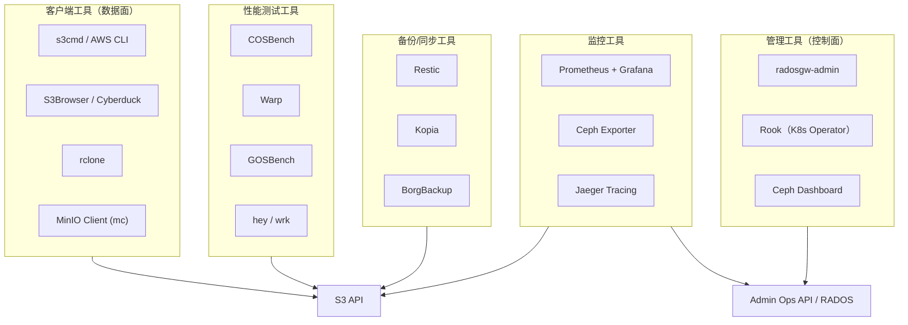

# 总览

# 客户端工具对比（数据面）
| 工具                | 类型        | 语言     | 特点                      | 适用场景          |
|-------------------|-----------|--------|-------------------------|---------------|
| s3cmd             | CLI       | Python | 轻量、脚本友好、支持同步            | 自动化备份脚本       |
| AWS CLI           | CLI       | Python | 功能最全、AWS 标准             | 完整 S3 功能需求    |
| S3Browser         | GUI (Win) | .NET   | 可视化、易用                  | Windows 手动管理  |
| Cyberduck         | GUI (跨平台) | Java   | 支持多种协议（S3/SFTP/WebDAV）  | 跨平台图形化管理      |
| rclone            | CLI       | Go     | 支持 40+ 存储后端、功能强大        | 多云/跨平台同步备份    |
| MinIO Client (mc) | CLI       | Go     | 轻量、类 Unix 命令风格、支持 alias | MinIO 生态、日常运维 |

# 性能测试工具  
| 工具       | 语言   | 特点                   | 适用场景       |
|----------|------|----------------------|------------|
| COSBench | Java | 功能全面、支持分布式负载         | 大规模性能验证    |
| Warp     | Go   | MinIO出品、S3原生、实时统计    | 日常基准测试     |
| GOSBench | Go   | 轻量静态二进制、Prometheus集成 | 自动化CI/CD测试 |
| hey      | Go   | HTTP压测工具、简单易用        | 简单吞吐量测试    |

# 监控与可观测性工具  
| 工具                     | 用途       | 特点                      |
|------------------------|----------|-------------------------|
| Prometheus + Grafana   | 指标采集+可视化 | 云原生标准、丰富的Ceph Dashboard |
| Ceph Exporter          | RGW指标导出  | 官方集成在ceph-mgr中          |
| RGW Textfile Collector | 自定义RGW指标 | 可导出桶分片数、对象数等            |
| Jaeger                 | 分布式追踪    | 定位RGW请求延迟瓶颈             |

# 备份与同步工具  
| 工具         | 语言     | 特点             | RGW兼容性       |
|------------|--------|----------------|--------------|
| Restic     | Go     | 增量备份、客户端加密、去重  | ✅ 完全兼容       |
| Kopia      | Go     | 快照式备份、GUI支持、压缩 | ✅ 完全兼容       |
| BorgBackup | Python | 成熟稳定、去重高效      | ⚠️ 需通过rclone |
