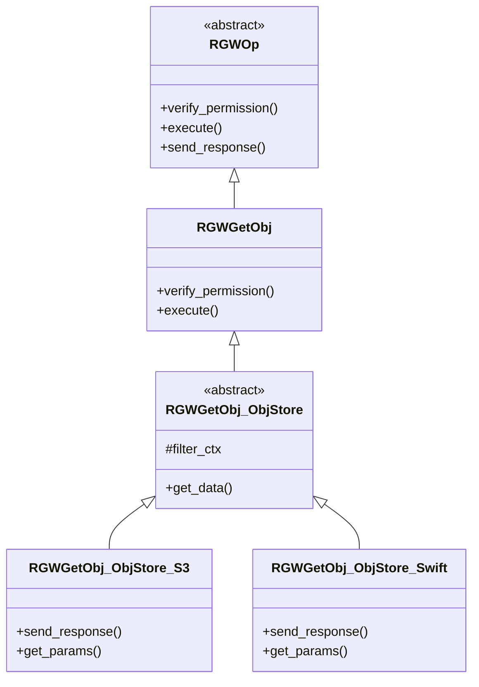

# 1 类继承体系与核心职责  

**核心职责**：将RADOS中存储的对象数据，通过HTTP响应流式返回给客户端。  

- `RGWOp` : 所有RGW操作的顶层基类
- `RGWGetObj` : 
- `RGWGettObj_ObjStore` : 协议无关的核心逻辑实现层。
- `RGWGetObj_ObjStore_S3` / `_Swift` : 协议相关的具体实现，负责解析特定协议（如S3或Swift）的请求头、参数，并按该协议格式发送响应

# 2 关键处理流程  

# 3 RGWGetObj核心流程  
Get下载分**pre_exec、execute、complete**三阶段：  
## 3.1 pre_exec  

## 3.2 execute  

## 3.3 complete  

