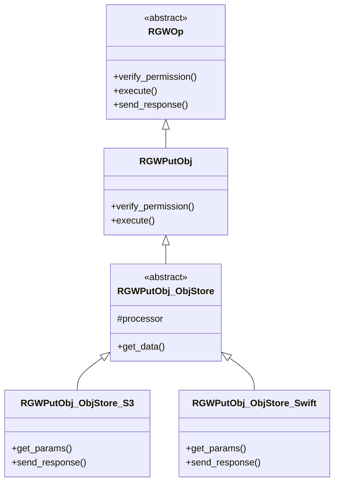
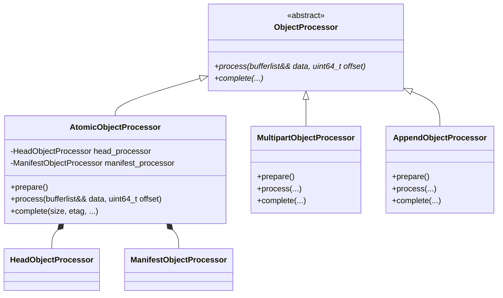

# 1 类继承体系与核心职责  

  


- `RGWOp` : 所有RGW操作的顶层基类，定义了 `verify_permission()`、`execute()`、`send_response()` 等标准生命周期方法。
- `RGWPutObj` : 对象上传操作的直接基类，在 `execute()` 中实现了上传流程的骨架。
- `RGWPutObj_ObjStore` : 协议无关的核心逻辑实现层。它不关心请求是通过S3还是Swift来的，专注于处理数据流和调用底层存储接口。
- `RGWPutObj_ObjStore_S3` / `_Swift` : 协议相关的具体实现，负责解析特定协议（如S3或Swift）的请求头、参数，并按该协议格式发送响应

# 2 分步流程简要说明  
## 2.1 协议解析与参数提取  
在 `RGWPutObj_ObjStore_S3::get_params()` 中，系统会解析HTTP请求，将各种头域转换为RGW的内部数据结构[^5]。这包括：

- **元数据**: 将 `x-amz-meta-` 开头的头域存入 `x_meta_map`。
- **访问策略**: 解析并创建S3兼容的策略对象。
- **对象标签**: 解析 `x-amz-tagging` 头。
- **对象锁**: 解析 `x-amz-object-lock-mode`、`x-amz-object-lock-retain-until-date` 等头域，用于WORM（一次写入，多次读取）功能。
- **MD5校验**: 获取 `Content-MD5` 头，用于端到端的数据完整性校验。
- **特殊模式识别**: 识别是否为Copy操作、分段上传、追加上传等。

## 2.2 权限验证  
`RGWPutObj` 基类实现的 `verify_permission()` 方法会检查请求者是否拥有目标桶的上传权限。这包括验证用户身份（签名）以及评估相关的桶策略（Bucket Policy）或ACL[^6]。  

## 2.3 数据处理器 (Processor) 初始化与选择

`RGWPutObj::execute()` 的核心逻辑是根据请求类型，初始化不同的数据处理器（Processor），将数据流导向不同的处理逻辑。`RGWPutObj_ObjStore` 作为基类，定义了使用处理器的框架。  

| 处理器类型                    | 适用场景                    | 关键行为                                        |
| ------------------------ | ----------------------- | ------------------------------------------- |
| AtomicObjectProcessor    | 普通单次PUT上传               | 在一个原子操作中完成对象数据的写入和元数据的更新。这是最常见的场景。          |
| MultipartObjectProcessor | 分段上传 (Multipart Upload) | 处理通过 UploadPart 请求上传的数据块，将其写入一个临时的、独特的分段对象。 |
| AppendObjectProcessor    | 追加上传 (Append Object)    | 允许在现有对象后追加数据，用于实现类似日志文件的操作模式。               |

## 2.4 数据流处理与写入  
这是数据面最核心的环节。`RGWPutObj_ObjStore::get_data()` 方法负责从socket读取HTTP请求体（即对象内容），并将其写入RADOS。
- **流式处理**: `get_data()` 会被循环调用，每次读取一块数据（通常为4MB），避免将整个大对象加载到内存中。
- **写入管道**: 获取到的数据块 `bufferlist` 被传递给选中的 `Processor`，后者负责将数据编码为RADOS对象，并写入到 `{zone}.rgw.buckets.data` 存储池中。
- **流量控制与记账**: 代码中通过 `ACCOUNTING_IO(s)->set_account(true)` 等宏来精确统计上传的字节数，用于带宽控制和计费[](https://git.ceph.com/?p=ceph.git;a=patch;h=refs/pull/16174/head)。
- **完整性校验**: 如果客户端提供了 `Content-MD5`，系统会在数据接收完成后计算接收数据的MD5值并与客户端提供的值进行比对，若不匹配则上传失败。

## 2.5 元数据更新与响应  
数据成功写入RADOS后，处理器会负责更新桶索引（Bucket Index）。桶索引记录了桶内所有对象的列表及其元数据（如名称、大小、ETag），这对于 `ListObjects` 操作至关重要。

最后，协议相关的子类（如 `RGWPutObj_ObjStore_S3`）会调用 `send_response()`，构造符合S3规范的响应，并将新对象的ETag（MD5哈希值）通过HTTP头返回给客户端。  

# 3 RGWPutObj - REST 前端操作（S3/Swift 入口）
```c++
class RGWPutObj : public RGWOp {

public:
    void pre_exec() override;
    void execute(optional_yield y) override;
}
```

## 3.1 核心执行阶段  
PUT 上传分**pre_exec、execute、complete**三阶段：  
### 3.1.1 阶段 1：pre_exec  
```c++
// s是基类RGWOP中字段：req_state *s
void RGWPutObj::pre_exec()
{
    rgw_bucket_object_pre_exec(s);
}
```

### 3.1.2 阶段2：execute  
```c++
//数据读写核心流程
void RGWPutObj::execute(optional_yield y)
{
    /* 主要处理如下：
    1. get_system_versioning_params()
    2. s->bucket->check_quota() // 配额检查
    3. s->object->swift_versioning_copy()
    4. res->publish_reserve()
    5. 根据场景生成一个std::unique_ptr<rgw::sal::Writer>
        if (multipart)  
            5.1 upload = s->bucket->get_multipart_upload()
            5.2 std::unique_ptr<rgw::sal::Writer> processor = upload->get_writer
        else if (append)
            5.3 std::unique_ptr<rgw::sal::Writer> processor = driver->get_append_writer
        else
            5.4 std::unique_ptr<rgw::sal::Writer> processor = driver->get_atomic_writer
    6. processor->prepare
    // rgw::sal::DataProcessor *filter = processor.get();
    7. 循环处理data
        7.1 RGWPutObj::get_data()
        7.2 filter->process()
    8. 处理压缩
    9. processor->complete()
    10. res->publish_commit
    */
}
```

主体简要流程介绍：  
1. 根据场景（分段上传/追加写/普通写）生成一个std::unique_ptr<rgw::sal::Writer> processor的对象实例
2. processor->prepare()：进行准备工作
3. 生成一个 `rgw::sal::DataProcessor *filter = processor.get()`（根据场景不同，分别是AtomicObjectProcessor/AppendObjectProcessor/MultipartObjectProcessor）
4. 循序读取（`RGWPutObj::get_data`）和写入（`filter->process()`）数据
5. 处理元数据
6. 收尾工作（`processor->complete()`）

#### 3.1.2.1 processor简要介绍
##### 3.1.2.1.1 普通put上传
`AtomicObjectProcessor` 是 Ceph RGW 为处理**非分段（non-multipart）PUT 请求**（包括常规 PUT、Copy 等）引入的一套**对象上传处理器框架**的核心组件。它采用**管道（Pipeline）设计模式**，通过组合多个 ` DataProcessor ` 将复杂对象上传流程拆解为清晰的阶段。  
`AtomicObjectProcessor` 将复杂的写入逻辑拆分到了多个独立的 `DataProcessor` 中，并通过 `Pipe` 管道串联。

`AtomicObjectProcessor` 直接继承自抽象基类 `rgw::putobj::ObjectProcessor`。该基类定义了所有对象上传处理器的统一接口：
- `process(bufferlist&& data, uint64_t offset)` ：处理数据流的写入。
- `complete(...) ` ：完成写入后的收尾工作（如写元数据、提交事务）。



AtomicObjectProcessor的核心作用体现在如下几个阶段：

| 阶段                  | 主要动作                    | 核心逻辑                                                                                                                                                                                          |
| ------------------- | ----------------------- | --------------------------------------------------------------------------------------------------------------------------------------------------------------------------------------------- |
| 1. 准备阶段 (prepare)   | 初始化 Manifest 与 Pipeline | 1. 确定分片策略：根据桶的配置确定 head_chunk_size 和 stripe_size（通常为 4MB）。<br>2. 建立处理管道：实例化 HeadObjectProcessor 和 ManifestObjectProcessor，组装成处理链路 head -> stripe -> chunk -> rados。                           |
| 2. 数据循环写入 (process) | 驱动管道处理数据流               | 1. 循环接收数据：从 HTTP 请求中不断读取数据块（bufferlist）。<br>2. 驱动管道：将数据块和逻辑偏移量（ofs）传递给管道头 HeadObjectProcessor::process()。<br>3. 处理边界：当数据跨越 4MB 边界时，驱动 ManifestObjectProcessor 创建新的 stripe 对象并更新 Manifest 元数据。 |
| 3. 完成收尾 (complete)  | 元数据持久化与事务提交             | 1. 处理尾部数据：处理暂存在 ChunkProcessor 中不满 4MB 的尾部数据（flush）。<br>2. 写入元数据：调用 `_do_write_meta` 将 Manifest、ACL、Attr 等元数据写入 RADOS。<br>3. 更新 Bucket 索引：最终在桶索引中完成对象条目的更新。                                   |

##### 3.1.2.1.2 分段上传  
MultipartObjectProcessor  

##### 3.1.2.1.3 append追加上传
AppendObjectProcessor

#### 3.1.2.2 准备工作  
处理函数： `processor->prepare()`  
##### 3.1.2.2.1 普通put上传  
`AtomicObjectProcessor::prepare()`  
1. 获取data pool： `get_obj_data_pool()` 
2. 获取head_chunk_size和pool对齐size(即alignment)， 其中head_chunk_size来源于 `cct->_conf->rgw_max_chunk_size`
3. 获取stripe_size，来源于 `_conf->rgw_obj_stripe_size`
4. 初始化管道结构，初始化ChunkProcessor chunk、StripeProcessor stripe，设置RadosWriter writer参数

#### 3.1.2.3 RGWPutObj::get_data  
`RGWPutObj::get_data` 是 Ceph RADOS Gateway (RGW) 处理普通（非分段）对象上传请求时的核心数据拉取函数。它的主要职责是**从 HTTP 请求中读取数据，并将其写入底层的 RADOS 存储集群**  

当 RGW 收到一个 `PUT` 请求后，会经历一个处理器（Processor）链式调用的过程。`get_data` 函数位于这个链条的后端，负责实际的数据拉取和处理。  

`get_data` 的行为会根据对象上传类型略有不同：

| 上传类型     | 对应的 Processor              | `get_data` 处理特点                                                                                                                |
| -------- | -------------------------- | ------------------------------------------------------------------------------------------------------------------------------ |
| **普通上传** | `AtomicObjectProcessor`    | 数据被连续写入。所有数据都写入后，原子性地更新对象元数据。                                                                                                  |
| **追加上传** | `AppendObjectProcessor`    | 维护一个追加位置指针 (`part_num`)，新的数据从该指针位置开始写入[](https://www.e-com-net.com/article/1671961074938765312.htm)。                           |
| **多段上传** | `MultipartObjectProcessor` | 每个 part 的数据写入一个独立的临时对象。在完成多段上传时，RGW 会组装这些临时对象的元数据，生成最终的 manifest[](https://www.e-com-net.com/article/1671961074938765312.htm)。 |

1. read_op->prepare()
2. rgw_compression_info_from_attrset()
3. obj->range_to_ofs()
4. filter->fixup_range()
5. read_op->iterate()
6. filter->flush()

#### 3.1.2.4 DataProcessor::process  

##### 3.1.2.4.1 普通put上传
AtomicObjectProcessor  
##### 3.1.2.4.2 分段上传  
MultipartObjectProcessor  

##### 3.1.2.4.3 append追加上传
AppendObjectProcessor


#### 3.1.2.5 处理元数据  

#### 3.1.2.6 processor->complete()  


### 3.1.3 阶段3：complete  


# 4 RGWPutObj_ObjStore - 底层存储驱动（直接写 RADOS） 

 `RGWPutObj_ObjStore` 是 Ceph RADOS Gateway (RGW) 中处理对象上传请求的核心基类， 在RGW的操作类体系中处于中间层位置。它位于S3和Swift等协议层与底层RADOS存储层之间，承担着参数解析、权限验证、数据处理与持久化的关键职责[^7]。

| 维度   | RGWPutObj                                                                                                          | RGWPutObj_ObjStore                                                                                          |
| ---- | ------------------------------------------------------------------------------------------------------------------ | ----------------------------------------------------------------------------------------------------------- |
| 归属模块 | REST 前端（S3/Swift 协议处理）                                                                                             | RADOS 存储驱动（后端存储）                                                                                            |
| 核心职责 | 1. 解析 HTTP 请求 / 头<br>2. 权限 / 条件 / 配额校验<br>3. 选择原子 / 分段处理器<br>4. 读数据、限流、校验<br>5. 调用底层存储接口，最终会到 `RGWPutObj_ObjStore` | 1. 纯数据写入（条带化、AIO）<br>2. 管理 obj_manifest<br>3. 写 RADOS 数据 / Shadow 对象<br>4. 计算 ETag/MD5/CRC<br>5. 原子提交、更新元数据 |
| 生命周期 | 每个 HTTP PUT 请求创建一个                                                                                                 | 被 RGWPutObj 创建并调用                                                                                           |
| 关键方法 | pre_exec()<br>execute()<br>complete()                                                                              | prepare()<br>process_data()<br>finish_data()<br>complete()                                                  |
| 调用关系 | 上层入口 → 调用下层                                                                                                        | 下层实现 → 被上层调用                                                                                                |
| 异常处理 | HTTP 状态码（403/412/400/500）                                                                                          | 内部错误码，抛给上层处理                                                                                                |
