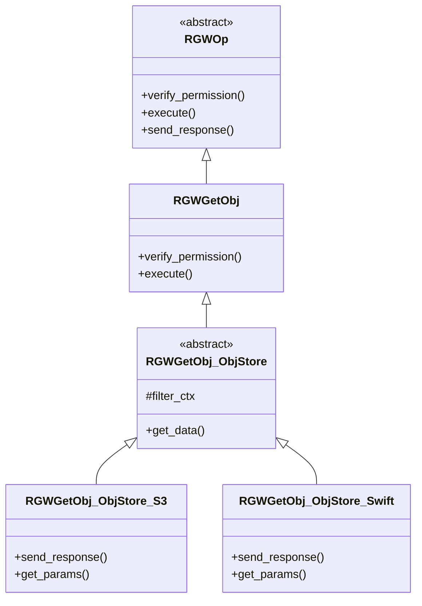
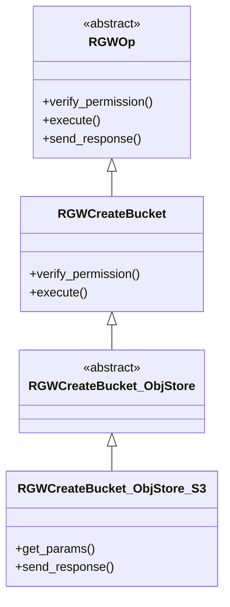
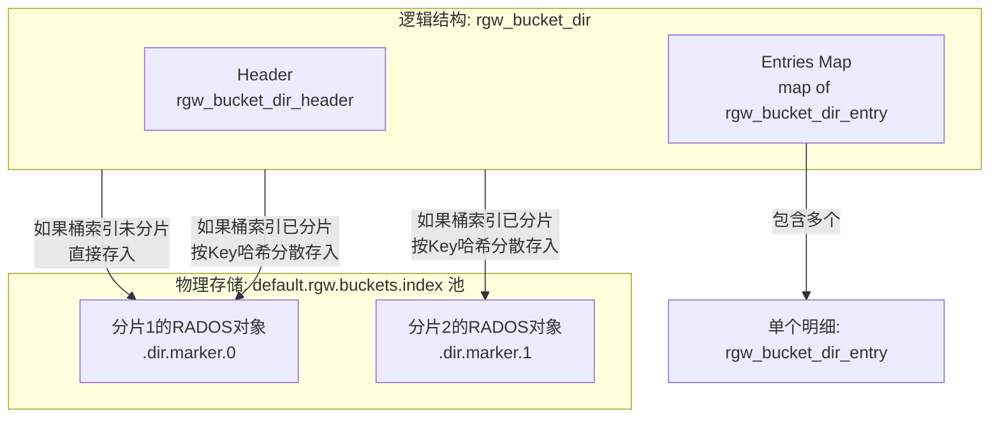
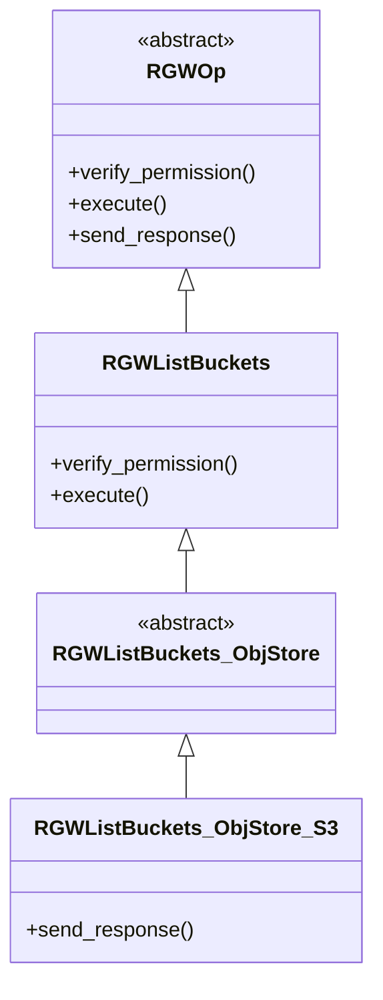
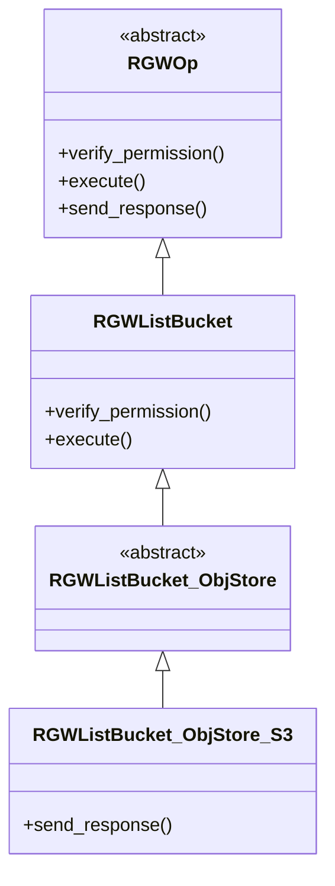

---
年份:
  - "2026"
月份:
  - 4月
imageNameKey: Rgw put和get的源码流程
tags:
  - rgw
  - ceph20
---


Ceph RGW 的 **Put Object（上传）** 与 **Get Object（下载）** 是对象存储的核心操作，整体遵循 “**请求接入 → 权限校验 → 元数据 / 索引处理 → 数据读写 → 响应返回**” 的流程，底层基于 **librados** 与 RADOS 集群交互。  

所有 RGW 请求（含 Put/Get）均从前端（如 Civetweb、Beast）接入，经统一调度后分发到对应操作类执行。  
# 1 概要  
## 1.1 处理框架
### 1.1.1 前端**Frontend**[^1]入口  
```c++
main() //rgw_main.cc
    -> rgw::AppMain::init_frontends1()
    -> rgw::AppMain::init_frontends2()
        -> if framework == "loadgen" => fe = new RGWLoadGenFrontend()
        -> else if framework == "beast"   => fe = new RGWAsioFrontend()
        -> else if framework == "rgw-nfs" => fe = new RGWLibFrontend()
        -> fe->init()
        -> fe->run()
```

Civetweb vs Beast[^2]是 **Ceph RGW (RADOS Gateway)** 支持的**前端（Frontend）**，负责处理 HTTP/HTTPS 请求并与 S3/Swift API 交互。  

Civetweb 配置方式：  
```bash
[client.rgw.tosa]
rgw_frontends = civetweb port=7480
# 带 SSL
rgw_frontends = civetweb port=7480 ssl_port=7481 ssl_certificate=/etc/ceph/cert.pem
# 更多选项
rgw_frontends = civetweb port=7480 num_threads=100 request_timeout_ms=30000
```
Beast 配置方式：  
```bash
[client.rgw.tosa]
rgw_frontends = beast port=8184
# 带 SSL
rgw_frontends = beast port=8184 ssl_port=8182 ssl_certificate=/etc/ceph/cert.pem
# 多线程（推荐）
rgw_frontends = beast port=8184 ssl_port=8182 ssl_certificate=/etc/ceph/cert.pem num_threads=24
```

Civetweb（多线程模型）  
```bash
客户端请求 → 主线程接收 → 分配线程 → 线程处理请求 → 返回响应
                ↓
        每增加一个连接，增加一个线程
        10,000 连接 = 10,000 个线程
```
Beast（异步模型）  
```bash
客户端请求 → IO 线程接收 → 注册回调 → 继续处理其他请求 → 回调返回响应
                ↓
        少量线程（如 24 个）处理数万连接
        10,000 连接 = 24 个线程
```

### 1.1.2 请求处理  
```c++
AsioFrontend::accept()  // rgw_aio_frontend.cc
    -> AsioFrontend::on_accept() // rgw_aio_frontend.cc
        -> void handle_connection() // rgw_aio_frontend.cc
            -> int process_request() // 核心处理函数：rgw_process.cc, 日志： starting new request req 
```
### 1.1.3 路由分发  

`rest->get_handler()` 根据 URL/Method 匹配 Handler（如 `RGWHandler_REST_S3`） → `handler->get_op()` 实例化操作类（`RGWPutObj` / `RGWGetObj`）  

class RGWOP 是虚类，各种操作对该类进行实现，比如 RGWGetObj(get操作)、RGWPutObj(put 操作）、RGWCreateBucket(创建桶操作)等等

```c++
class RGWRESTMgr {
    virtual RGWHandler_REST* get_handler()
}

class RGWOp : public DoutPrefixProvider {
protected:
    req_state *s;
public:
    virtual void send_response() {}
    virtual void pre_exec() {}
    virtual void execute(optional_yield y) = 0;
    virtual void complete() {
        send_response();
    }
}

int process_request()
    -> RGWHandler_REST *handler = rest->get_handler() //根据请求方法（PUT）、URL（bucket/object）匹配 S3 处理器
        -> preprocess()
    -> op = handler->get_op(); // 获取实例化操作类，比如RGWPutObj/RGWGetObj
    -> rgw::lua::request::execute()
    -> op->verify_requester(); //认证
    -> rgw_process_authenticated() //认证完成后的op执行流程
    -> （RGWRestfulIO)client_io->complete_request() //完成请求
```


### 1.1.4 执行流程  
```c++
rgw_process_authenticated() //认证完成后的op执行流程
    -> handler->init_permissions()
    -> op->init_processing()
    -> op->verify_op_mask()
    -> op->verify_permission(y);
    -> op->verify_params()
    -> op->pre_exec() //step1: 预处理，前置校验与准备
    -> op->execute()  //step2: 数据读写核心流程
    -> op->complete() //step3: 元数据更新与收尾
```

## 1.2 强一致性保证  
- **强一致性**：为了保证对象的上传/删除与索引更新的原子性，RGW设计了一套**3步索引事务（Index Transaction）** 机制[^3]。
    1. **Prepare**：在索引中预操作，将对象标记为 `pending` （待处理）状态。
    2. **Write/Delete**：在数据池中执行实际的对象数据写入或删除。
    3. **Commit/Cancel**：若数据操作成功，则提交事务，将索引条目状态更新为 `completed` （已完成）；若失败，则取消事务。
- **故障自愈**：如果RGW在处理过程中崩溃，可能会导致某些索引条目长时间停留在 `pending` 状态。当客户端后续列出桶时，RGW会检测到这些 `pending` 条目，并去检查对应的实际对象是否存在，然后用检查结果来“修正”索引（这个过程称为 `dir suggest` ）  [^4]

# 2 [Put上传流程](Put上传流程.md)  

# 3 Get流程  
## 3.1 类继承体系与核心职责  

**核心职责**：将RADOS中存储的对象数据，通过HTTP响应流式返回给客户端。  


## 3.2 关键处理流程  




# 4 创建Bucket流程  
用 S3 命令（s3cmd /awscli/boto3 等）创建的是 RadosBucket（标准对象存储桶）[^8]

```c++
class RGWCreateBucket_ObjStore_S3 : public RGWCreateBucket_ObjStore {
public:
    RGWCreateBucket_ObjStore_S3() {}
    ~RGWCreateBucket_ObjStore_S3() override {}

    int get_params(optional_yield y) override;
    void send_response() override;
};


class RGWCreateBucket_ObjStore : public RGWCreateBucket {
public:
  RGWCreateBucket_ObjStore() {}
  ~RGWCreateBucket_ObjStore() override {}

  virtual std::string canonical_name() const override { return fmt::format("REST.{}.BUCKET", s->info.method); }
};

class RGWCreateBucket : public RGWOp {
    int verify_permission(optional_yield y) override;
    void pre_exec() override;
    void execute(optional_yield y) override;
    void init(rgw::sal::Driver* driver, req_state *s, RGWHandler *h) override {
        RGWOp::init(driver, s, h);
        relaxed_region_enforcement =
        s->cct->_conf.get_val<bool>("rgw_relaxed_region_enforcement");
    }
    virtual int get_params(optional_yield y) { return 0; }
    void send_response() override = 0;
}

// rgw_sal_rados.h
class RadosBucket : public StoreBucket {

}
```

类继承体系：  



## 4.1 创建整体简要流程  
### 4.1.1 API 入口与权限校验
RGWCreateBucket::verify_permission()  
1. 用户权限检查： verify_user_permission()
2. 检查用户的桶数量上限： check_owner_max_buckets()

### 4.1.2 核心流程  
RGWCreateBucket::execute(optional_yield y)  
1. **选择placement**  
select_bucket_placement() //select and validate the placement target

2. **检查是否已经存在待创建的桶**    
    - 加载处理：driver->load_bucket(), 即RadosBucket::load_bucket()  
        - if bucket_id为空，则 `store->ctl()->bucket->read_bucket_info`
            - read_bucket_entrypoint_info()
            - read_bucket_instance_info()
                - do_read_bucket_instance_info
        - 否则：`store->ctl()->bucket->read_bucket_instance_info`
    - 如果存在：获取已存在桶的部分属性作为待创建桶的参数
        - swift_ver_location
        - placement_rule

3. **组装创建桶需要的参数**    
    - zonegroup_id
    - zone_placement
    - swift_ver_location
    - placement_rule
    - owner
    - attrs(不局限于如下两个)
        - RGW_ATTR_ACL
        - RGW_ATTR_CORS
    - quota

4. **检查是否是master zone，如果不是，则优先转发给master创建**
    - rgw_forward_request_to_master()
    - 如下从master获取
        - marker
        - bucket_id
        - zonegroup_id
        - obj_lock_enabled
        - quota
        - creation_time
5. **创建桶并且持久化    
    - 创建bucket:  s->bucket->create(this, createparams, y)
        - RadosBucket::create()  
            - store->get_rados()->create_bucket():  RGWRados::create_bucket(...)
                - 生成版本号： generate_new_write_ver()
                - 创建桶id： create_bucket_id()
                - RGWRados::put_linked_bucket_info()
                    - 元数据持久化 BucketInfo结构：RGWRados::put_bucket_instance_info
                    - ctl.bucket->store_bucket_entrypoint_info()
            - RadosBucket::link()
                - store->ctl()->bucket->link_bucket() - RGWBucketCtl::link_bucket() 
                    - 持久化bucket entrypoint结构： - svc.bucket->store_bucket_entrypoint_info()
            - store->ctl()->bucket->read_bucket_entrypoint_info()

扩展属性（xattrs/attrs）处理 ？
原子提交与返回  ？  

### 4.1.3 元数据  

#### 4.1.3.1 BucketEntryPoint  
Bucket 的入口信息（BucketEntryPoint），也就是桶的 “身份证”  ,可以把 `EntryPoint` 理解为一个从不更改的**门牌号**，而 `RGWBucketInfo` 则是门牌号背后可能随时调整的**住户档案**。这种分离设计是 RGW 实现**桶重分片（resharding）**、**多区域**等高级特性的基础。

读取函数：   
RGWSI_Bucket_SObj::read_bucket_entrypoint_info(),   
```c++
int RGWSI_Bucket_SObj::read_bucket_entrypoint_info(
    const string& key,                          // 桶的key：root/bucket.{bucket_name}
    RGWBucketEntryPoint *entry_point,           // 输出：解码后的桶入口信息
    RGWObjVersionTracker *objv_tracker,         // 对象版本追踪
    real_time *pmtime,                          // 输出：修改时间
    map<string, bufferlist> *pattrs,            // 输出：扩展属性 xattrs
    optional_yield y,                           // 协程yield
    const DoutPrefixProvider *dpp,              // 日志
    rgw_cache_entry_info *cache_info,           // 缓存
    boost::optional<obj_version> refresh_version)
```
其中RGW 存储桶入口元数据的 RADOS 池， 默认 default.rgw.meta，const rgw_pool& pool = svc.zone->get_zone_params().domain_root

可以使用 `radosgw-admin zone get --default` 查询  :  
```bash
{
    "id": "0f2f1491-1607-439d-a1b0-6e88fe76cc6d",
    "name": "default",
    "domain_root": "default.rgw.meta:root",
    "control_pool": "default.rgw.control",
    "dedup_pool": "default.rgw.dedup",
    "gc_pool": "default.rgw.log:gc",
    ...
}
```

读取omap： RGWSI_SysObj_Core::read()  
- librados::ObjectReadOperation op 
    - op.read(ofs, len, bl, nullptr)
    - op.getxattrs()
- RGWSI_SysObj_Core::get_rados_obj
- RGWSI_SysObj_Core::rgw_rados_operate

#### 4.1.3.2 Bucket信息-RGWBucketInfo
 `RGWBucketInfo` 包含了管理一个 bucket 所需的所有动态元数据。如果说 EntryPoint 是“门牌号”，那么 Info 就是“房间内部的所有装修和配置”。  

在 RADOS 存储中，`RGWBucketInfo` 对象存储为 `.bucket.meta.{tenant}:{bucket-name}:{bucket-id}`，通常位于与 EntryPoint 相同的 `{zone}.rgw.meta` 池中。  

它的数据结构比 EntryPoint 复杂得多，包含但不限于以下核心字段：

| 核心功能分类 | 字段示例                                        | 作用说明                                                                                                                                                                      |
| ------ | ------------------------------------------- | ------------------------------------------------------------------------------------------------------------------------------------------------------------------------- |
| 基础身份   | `bucket`                                    | 包含完整的 `bucket_id`，其值必须与 `EntryPoint` 中的 ID 严格一致。                                                                                                                          |
| 拥有者与权限 | `owner`, `acl`                              | 定义谁拥有这个桶以及详细的访问控制策略。                                                                                                                                                      |
| 存储策略   | `placement_rule`, `data_pool`, `index_pool` | 决定数据存储在哪个存储池、使用何种存储类别（如SSD/HDD）以及索引分片数量等[](https://blog.csdn.net/weixin_39648824/article/details/114750529)[](https://www.e-com-net.com/article/1643860215952629760.htm)。 |
| 配额与配置  | `quota`, `flags`, `versioning`              | 配置桶的容量配额、是否启用版本控制等高级功能。                                                                                                                                                   |
| 运行时状态  | `objv_tracker`                              | 一个版本追踪器，用于确保分布式环境下的并发操作安全。                                                                                                                                                |
#### 4.1.3.3 核心元数据  


#### 4.1.3.4 桶索引
`rgw_bucket_dir_header` 、 `rgw_bucket_dir` 、 `rgw_bucket_dir_entry`是桶索引相关内容  
可以将它们理解为一个“账本”系统：

-  `rgw_bucket_dir_header` ：是账本的封面，记录了桶的统计摘要（如对象总数、已用容量）。
-  `rgw_bucket_dir` ：是**账本本身** ，作为一个容器，包含了Header和所有的账目明细。
- `rgw_bucket_dir_entry` ：是**账本中的每一笔明细**，记录了桶中单个对象的元数据信息。


1. **写入流程**：当一个对象被成功上传到 `default.rgw.buckets.data` 池后，RGW会更新桶索引。
    - 它会找到对象Key所属的索引分片（RADOS对象，通常名为 `.dir.{bucket_marker}.{shard_id}` ）。
    - 在该RADOS对象的**omap**中，创建一个Key为对象名的键值对，Value就是序列化后的 `rgw_bucket_dir_entry` ，包含了该对象的大小、ETag等信息。
    - 同时，更新该分片的 `rgw_bucket_dir_header` ，如增加 `num_entries` 和 `total_size` 的值。
2. **读取流程**：当客户端请求列出桶内对象时（ `ListObjects` ）：
    - RGW会读取桶索引所有分片的 `rgw_bucket_dir` 。
    - 对于每个分片，它读取 `rgw_bucket_dir_header` 获取统计摘要，并根据请求的 `prefix` 、 `marker` 等参数，遍历 `rgw_bucket_dir_entry` 的map。
    - 将这些 `rgw_bucket_dir_entry` 中记录的对象元数据返回给客户端。


#### 4.1.3.5 名称映射   


### 4.1.4 扩展属性  

两类属性：系统 vs 用户    
- **系统属性（System attrs）**：RGW 内部使用
    - `user`、`owner`、`owner_display_name`
    - `acl`、`policy`、`creation_time`
    - `quota`、`max_size`、`max_objects`
    - `placement_id`、`zonegroup`、`region`
    - `versioning`、`encryption`、`lock_mode`
- **用户扩展属性（User xattrs）**
    - S3：`x-amz-meta-key: value`
    - Swift：`X-Object-Meta-*`
    - Bucket tags（`tag1=val1&tag2=val2`
存储位置（关键）：  

# 5 List buckets-列举桶
RGWListBuckets_ObjStore_S3
**核心职责**：返回用户拥有的桶列表，支持分页、前缀过滤等参数

对应操作： python3 /usr/bin/s3cmd ls s3://my-new-bucket

```c++
class RGWListBuckets_ObjStore_S3 : public RGWListBuckets_ObjStore {

}

class RGWListBuckets_ObjStore : public RGWListBuckets {

}

class RGWListBuckets : public RGWOp {
public:
    void pre_exec() override;
    void execute(optional_yield y) override;
}
```

类继承体系：  




### 5.1.1 核心执行阶段  
#### 5.1.1.1 RGWListBucket::execute  

# 6 RGWListBucket-查询桶内容  
**核心职责**：返回指定桶内的对象列表，支持分页、前缀过滤、版本控制等参数。  

**类继承体系**  


# 7 核心操作对比  

## 7.1 上传、下载、创建桶、查询桶列表和查询桶内容对比

| 维度     | RGWGetObj_ObjStore                | RGWCreateBucket                      | RGWListBuckets           | RGWListBucket                                 |
| ------ | --------------------------------- | ------------------------------------ | ------------------------ | --------------------------------------------- |
| 核心操作类型 | 数据读（Data Read）                    | 元数据写（Meta Write）                     | 元数据读（Meta Read）          | 索引读（Index Read）                               |
| 涉及的存储池 | data + index                      | meta + index                         | meta                     | index                                         |
| 主要数据结构 | rgw_bucket_dir_entry<br>RADOS对象分片 | RGWBucketEntryPoint<br>RGWBucketInfo | 用户桶列表对象<br>RGWBucketInfo | rgw_bucket_dir_header<br>rgw_bucket_dir_entry |
| 性能瓶颈   | 磁盘I/O + 网络带宽                      | 元数据池的写入延迟                            | 用户桶列表对象的大小               | 索引分片数量 + 对象数量                                 |
| 特殊功能   | Range请求、加密解密、压缩解压                 | 桶分片、存储类、对象锁                          | 分页、前缀过滤、缓存               | delimiter目录模拟、版本控制分页                          |
| 幂等性    | GET 天然幂等                          | 重复创建返回错误                             | 天然幂等                     | GET 天然幂等                                      |

## 7.2 其他操作对比  
下表对这些操作按功能领域进行了分类和梳理[^9]：  

| 功能领域  | 对应操作                                                                | 核心职责                             | 涉及的关键数据/组件                                          |
| ----- | ------------------------------------------------------------------- | -------------------------------- | --------------------------------------------------- |
| 对象操作  | RGWDeleteObj                                                        | 删除对象                             | 桶索引 (Bucket Index), GC (Garbage Collection) 队列[^10] |
|       | RGWCopyObj                                                          | 在桶内或跨桶复制对象                       | 源/目标对象的元数据和数据                                       |
| 分段上传  | RGWInitMultipart                                                    | 初始化分段上传，生成 UploadId              | RGWBucketInfo, 上传队列[^11]                            |
|       | RGWPutObj                                                           | 上传一个分片 (Part)                    | RGWPutObjProcessor_Multipart, 临时存储对象                |
|       | RGWCompleteMultipart                                                | 组合所有分片，完成上传                      | 对象清单 (manifest), 最终对象元数据                            |
|       | RGWAbortMultipart                                                   | 取消上传，清理已上传的分片                    | GC 队列                                               |
|       | RGWListMultipart                                                    | 列出一个正在进行中的上传任务的分片信息              | 上传任务的元数据对象                                          |
|       | RGWListBucketMultiparts                                             | 列出一个桶中所有正在进行中的上传任务               | 桶索引的 omap                                           |
| 桶管理   | RGWDeleteBucket                                                     | 删除一个空桶                           | RGWBucketEntryPoint, RGWBucketInfo                  |
|       | RGWStatBucket                                                       | 获取桶的元数据信息（如大小、对象数）               | RGWBucketInfo, 桶索引头                                 |
|       | RGWGetBucketLogging / RGWSetBucketLogging                           | 获取/设置桶的日志记录配置                    | 桶属性 (xattrs)                                        |
|       | RGWGetBucketVersioning / RGWSetBucketVersioning                     | 获取/设置桶的版本控制状态                    | RGWBucketInfo                                       |
| 策略与权限 | RGWGetACLs / RGWPutACLs                                             | 获取/设置桶或对象的访问控制列表 (ACL)           | 对象的 RGW_ATTR_ACL 属性                                 |
|       | RGWGetCORS / RGWPutCORS / RGWDeleteCORS                             | 获取/设置/删除桶的跨域资源共享 (CORS) 配置       | 桶的 RGW_ATTR_CORS 属性                                 |
|       | RGWGetRequestPayment / RGWSetRequestPayment                         | 获取/设置请求者付款功能                     | 桶属性                                                 |
| 元数据管理 | RGWPutMetadataAccount / RGWPutMetadataBucket / RGWPutMetadataObject | 更新账户、桶、对象的元数据                    | 账户/桶/对象的 xattrs                                     |
| 其他    | RGWOptionsCORS                                                      | 处理 CORS 预检请求 (Preflight Request) | CORS 配置                                             |
|       | RGWDeleteMultiObj                                                   | 批量删除对象                           | 桶索引, GC 队列                                          |
|       | RGWSetTempURL                                                       | 为 Swift 接口设置临时 URL 密钥            | 账户的元数据                                              |
|       | RGWStatAccount                                                      | 获取账户的元数据信息（如桶个数、用量）              | 用户元数据对象                                             |


[^1]: RGW Frontend 是 Ceph RGW 的 **HTTP 服务器组件**，负责：
    - 监听端口接收 S3/Swift API 请求
    - 解析 HTTP 请求
    - 调用 RGW 核心逻辑处理请求
    - 返回响应给客户端  

[^2]: Civetweb 和 Beast 比较

    | 对比项       | Civetweb            | Beast                  |
    |-----------|---------------------|------------------------|
    | 默认版本      | Luminous (12.x) 及之前 | Nautilus (14.x) 及之后    |
    | 并发模型      | 多线程（每连接一线程）         | 异步非阻塞（少量线程）            |
    | HTTP/2    | ❌ 不支持               | ✅ 支持                   |
    | WebSocket | ❌ 不支持               | ✅ 支持                   |
    | SSL/TLS   | OpenSSL（性能一般）       | OpenSSL/BoringSSL（优化好） |
    | 高并发性能     | 一般（~10k 连接）         | 优秀（>100k 连接）           |
    | 延迟        | 中等（线程切换开销）          | 低（事件驱动）                |
    | 内存占用      | 每连接独立栈（较高）          | 共享事件循环（较低）             |
    | CPU 利用率   | 线程竞争较多              | 更平滑                    |
    | 配置复杂度     | 简单                  | 中等                     |
    | 调试难度      | 简单                  | 中等                     |
    | 开发活跃度     | 低（仅维护）              | 高（主推）                  |

[^3]: https://cephdocs.readthedocs.io/en/latest/dev/radosgw/bucket_index/
[^4]: https://cephdocs.readthedocs.io/en/latest/dev/radosgw/bucket_index/
[^5]: https://www.programmersought.com/article/37449037100/
[^6]: https://deepwiki.com/ceph/ceph/4-client-interfaces
[^7]: https://deepwiki.com/ceph/ceph/4-client-interfaces
[^8]: 参阅：[Bucket(桶)简要介绍](../基本概念/Bucket(桶)简要介绍.md)
[^9]: https://deepwiki.com/ceph/ceph/4.1-rados-gateway-(rgw)
[^10]: https://cloud.tencent.cn/developer/article/1032873?from=15425
[^11]: https://blog.csdn.net/weixin_34270606/article/details/92578903  
