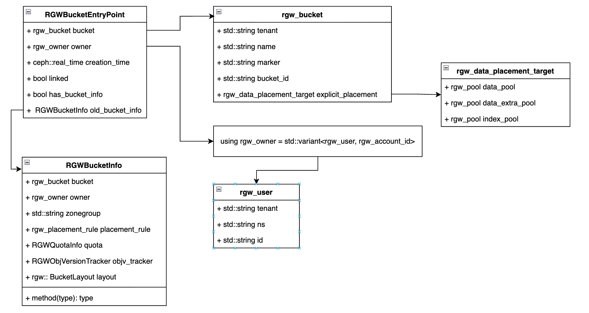
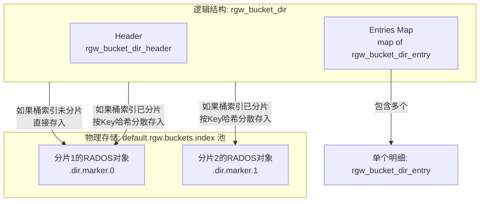

### 0.1.1 元数据  
核心实现在 `RGWRados::Object::Write::_do_write_meta` 里，函数里面的op是元数据操作，index_op是index操作
#### 0.1.1.1 BucketEntryPoint  
Bucket 的入口信息（BucketEntryPoint），也就是桶的 “身份证”  ,可以把 `EntryPoint` 理解为一个从不更改的**门牌号**，而 `RGWBucketInfo` 则是门牌号背后可能随时调整的**住户档案**。这种分离设计是 RGW 实现**桶重分片（resharding）**、**多区域**等高级特性的基础。  

```c++
struct RGWBucketEntryPoint
{
  rgw_bucket bucket;
  rgw_owner owner;
  ceph::real_time creation_time;
  bool linked;
  bool has_bucket_info;
  RGWBucketInfo old_bucket_info;

  RGWBucketEntryPoint() : linked(false), has_bucket_info(false) {}
  void encode(bufferlist& bl) const {
      ...
  }
  void decode(bufferlist::const_iterator& bl) {
      ...
  }
  void dump(Formatter *f) const;
  void decode_json(JSONObj *obj);
};
```

简要类图如下：  
  


读取函数：   
RGWSI_Bucket_SObj::read_bucket_entrypoint_info(...),   详细声明如下：
```c++
int RGWSI_Bucket_SObj::read_bucket_entrypoint_info(
    const string& key,                          // 桶的key：root/bucket.{bucket_name}
    RGWBucketEntryPoint *entry_point,           // 输出：解码后的桶入口信息
    RGWObjVersionTracker *objv_tracker,         // 对象版本追踪
    real_time *pmtime,                          // 输出：修改时间
    map<string, bufferlist> *pattrs,            // 输出：扩展属性 xattrs
    optional_yield y,                           // 协程yield
    const DoutPrefixProvider *dpp,              // 日志
    rgw_cache_entry_info *cache_info,           // 缓存
    boost::optional<obj_version> refresh_version)
{
    //1. 读取bucket entrypoint
    int r = read_bucket_entrypoint_info(*b, &(*ep), y, dpp, RGWBucketCtl::Bucket::GetParams().set_objv_tracker(ep_objv_tracker));
    
    //2. 读取bucket instance info
    int ret = svc.bucket->read_bucket_instance_info(RGWSI_Bucket::get_bi_meta_key(*b),
                                                  info,
                                                  params.mtime,
                                                  params.attrs,
                                                  y, dpp,
                                                  params.cache_info,
                                                  params.refresh_version);
}
```
其中RGW 存储桶入口元数据的 RADOS 池， 默认 default.rgw.meta，const rgw_pool& pool = svc.zone->get_zone_params().domain_root

可以使用 `radosgw-admin zone get --default` 查询  :  
```bash
{
    "id": "0f2f1491-1607-439d-a1b0-6e88fe76cc6d",
    "name": "default",
    "domain_root": "default.rgw.meta:root",
    "control_pool": "default.rgw.control",
    "dedup_pool": "default.rgw.dedup",
    "gc_pool": "default.rgw.log:gc",
    ...
}
```

读取omap： RGWSI_SysObj_Core::read()  
- librados::ObjectReadOperation op 
    - op.read(ofs, len, bl, nullptr)
    - op.getxattrs()
- RGWSI_SysObj_Core::get_rados_obj
- RGWSI_SysObj_Core::rgw_rados_operate

#### 0.1.1.2 Bucket信息-RGWBucketInfo
 `RGWBucketInfo` 包含了管理一个 bucket 所需的所有动态元数据。如果说 EntryPoint 是“门牌号”，那么 Info 就是“房间内部的所有装修和配置”。  

在 RADOS 存储中，`RGWBucketInfo` 对象存储为 `.bucket.meta.{tenant}:{bucket-name}:{bucket-id}`，通常位于与 EntryPoint 相同的 `{zone}.rgw.meta` 池中。  

它的数据结构比 EntryPoint 复杂得多，包含但不限于以下核心字段：

| 核心功能分类 | 字段示例                                        | 作用说明                                                                                                                                                                      |
| ------ | ------------------------------------------- | ------------------------------------------------------------------------------------------------------------------------------------------------------------------------- |
| 基础身份   | `bucket`                                    | 包含完整的 `bucket_id`，其值必须与 `EntryPoint` 中的 ID 严格一致。                                                                                                                          |
| 拥有者与权限 | `owner`, `acl`                              | 定义谁拥有这个桶以及详细的访问控制策略。                                                                                                                                                      |
| 存储策略   | `placement_rule`, `data_pool`, `index_pool` | 决定数据存储在哪个存储池、使用何种存储类别（如SSD/HDD）以及索引分片数量等[](https://blog.csdn.net/weixin_39648824/article/details/114750529)[](https://www.e-com-net.com/article/1643860215952629760.htm)。 |
| 配额与配置  | `quota`, `flags`, `versioning`              | 配置桶的容量配额、是否启用版本控制等高级功能。                                                                                                                                                   |
| 运行时状态  | `objv_tracker`                              | 一个版本追踪器，用于确保分布式环境下的并发操作安全。                                                                                                                                                |
#### 0.1.1.3 核心元数据  


#### 0.1.1.4 桶索引
`rgw_bucket_dir_header` 、 `rgw_bucket_dir` 、 `rgw_bucket_dir_entry` 是桶索引相关内容  
可以将它们理解为一个“账本”系统：

-  `rgw_bucket_dir_header` ：是账本的封面，记录了桶的统计摘要（如对象总数、已用容量）。
-  `rgw_bucket_dir` ：是**账本本身** ，作为一个容器，包含了Header和所有的账目明细。
- `rgw_bucket_dir_entry` ：是**账本中的每一笔明细**，记录了桶中单个对象的元数据信息。


1. **写入流程**：当一个对象被成功上传到 `default.rgw.buckets.data` 池后，RGW会更新桶索引。
    - 它会找到对象Key所属的索引分片（RADOS对象，通常名为 `.dir.{bucket_marker}.{shard_id}` ）。
    - 在该RADOS对象的**omap**中，创建一个Key为对象名的键值对，Value就是序列化后的 `rgw_bucket_dir_entry` ，包含了该对象的大小、ETag等信息。
    - 同时，更新该分片的 `rgw_bucket_dir_header` ，如增加 `num_entries` 和 `total_size` 的值。
2. **读取流程**：当客户端请求列出桶内对象时（ `ListObjects` ）：
    - RGW会读取桶索引所有分片的 `rgw_bucket_dir` 。
    - 对于每个分片，它读取 `rgw_bucket_dir_header` 获取统计摘要，并根据请求的 `prefix` 、 `marker` 等参数，遍历 `rgw_bucket_dir_entry` 的map。
    - 将这些 `rgw_bucket_dir_entry` 中记录的对象元数据返回给客户端。


#### 0.1.1.5 名称映射   


### 0.1.2 扩展属性  

两类属性：系统 vs 用户    
- **系统属性（System attrs）**：RGW 内部使用
    - `user`、`owner`、`owner_display_name`
    - `acl`、`policy`、`creation_time`
    - `quota`、`max_size`、`max_objects`
    - `placement_id`、`zonegroup`、`region`
    - `versioning`、`encryption`、`lock_mode`
- **用户扩展属性（User xattrs）**
    - S3：`x-amz-meta-key: value`
    - Swift：`X-Object-Meta-*`
    - Bucket tags（`tag1=val1&tag2=val2`
存储位置（关键）：  