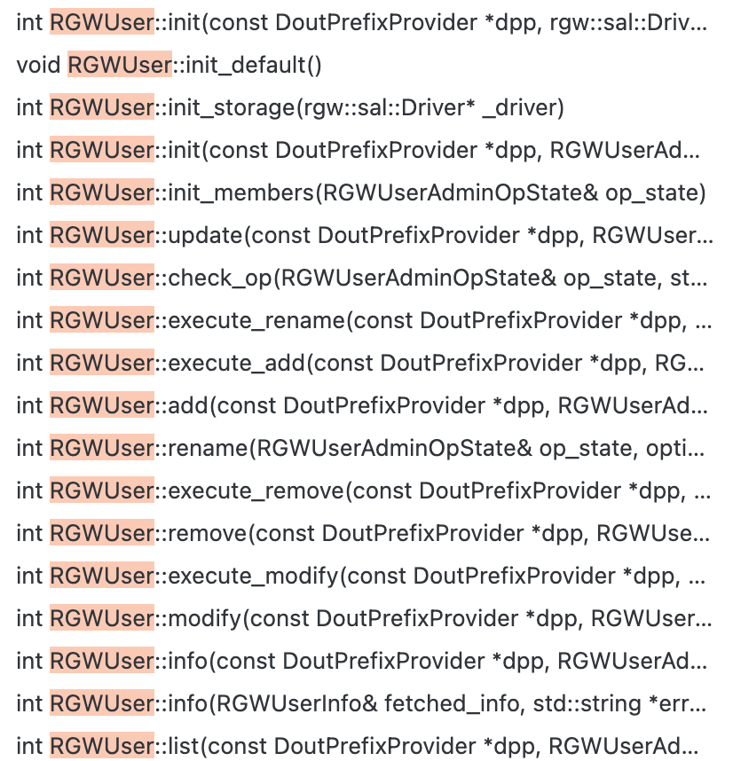

1. 命令入口：所有 `radosgw-admin` 命令的入口都在 `src/rgw/rgw_admin.cc` 文件中
2. 用户管理核心逻辑： `src/rgw/rgw_user.cc`
3. `radosgw-admin` 支持的所有 command
```c++
static SimpleCmd::Commands all_cmds = {
    ...
}
```
# 1 用户管理  
`radosgw-admin user [xxx]`  
## 1.1 用户创建  
1. 命令解析
```c++
// src/rgw/rgw_admin.cc
// 1. 初始化user，并判断合法性
RGWUser user;
  int ret = 0;
  if (!(user_id.empty() && access_key.empty()) || !subuser.empty()) {
    ret = user.init(store, user_op);
    if (ret < 0) {
      cerr << "user.init failed: " << cpp_strerror(-ret) << std::endl;
      return -ret;
    }
  }

// 2. 
case OPT::USER_CREATE:
    ret = user.add(user_op, &err_msg);
    if (ret < 0) {
        cerr << "could not create user: " << err_msg << std::endl;
        if (ret == -ERR_INVALID_TENANT_NAME)
        ret = -EINVAL;

        return -ret;
    }
    
    if (!subuser.empty()) {
        ret = user.subusers.add(user_op, &err_msg);
        if (ret < 0) {
            cerr << "could not create subuser: " << err_msg << std::endl;
            return -ret;
        }
    }
```

2. 逻辑处理 
- src/rgw/rgw_user.cc
```c++
RGWUser::add()
    -> user_add_helper()
    -> check_op()
    -> RGWUser::execute_add() //主要处理函数
        -> RGWUser::update()
            -> rgw::sal::User::store_user() //持久化user信息

```

备注：下列是 rgw_use.cc 中的 op 支持情况  
   


# 参考  
1. [radosgw-admin工具](操作类/radosgw-admin工具.md)
