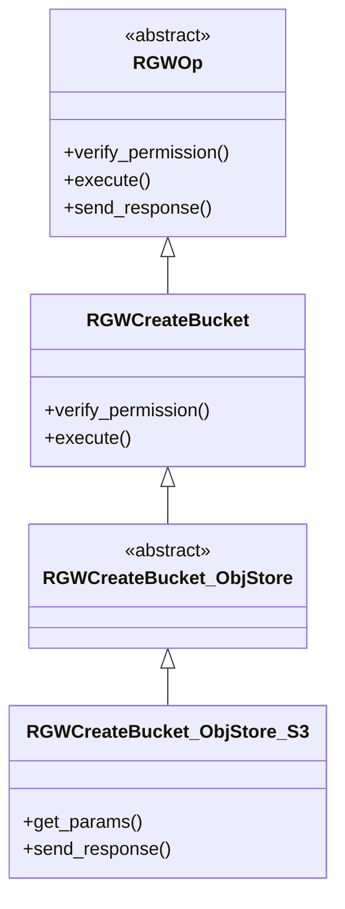
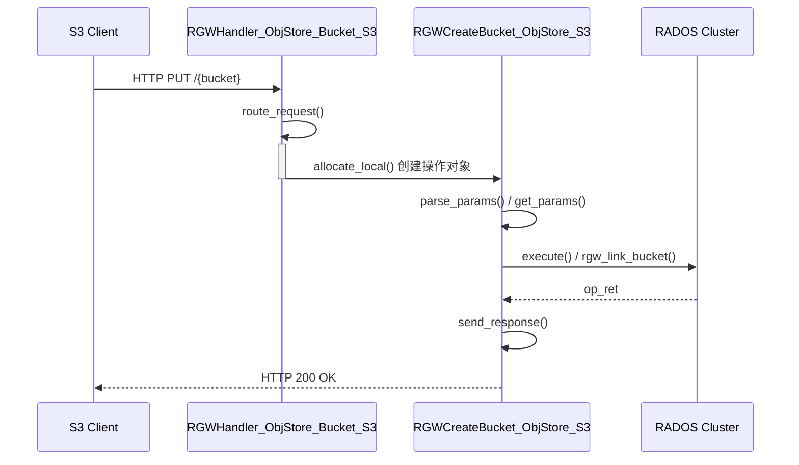
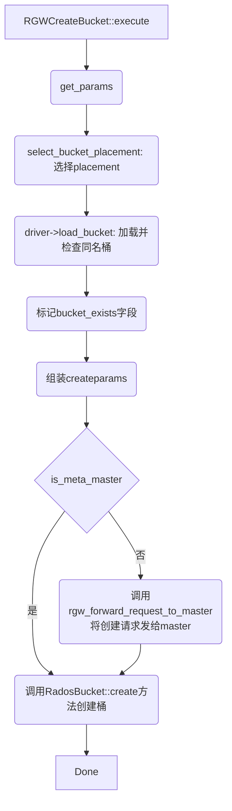

用 S3 命令（s3cmd /awscli/boto3 等）创建的是 RadosBucket（标准对象存储桶）[^1]
# 1 OP类继承体系  
```c++
class RGWCreateBucket_ObjStore_S3 : public RGWCreateBucket_ObjStore {
public:
    RGWCreateBucket_ObjStore_S3() {}
    ~RGWCreateBucket_ObjStore_S3() override {}

    int get_params(optional_yield y) override;
    void send_response() override;
};


class RGWCreateBucket_ObjStore : public RGWCreateBucket {
public:
  RGWCreateBucket_ObjStore() {}
  ~RGWCreateBucket_ObjStore() override {}

  virtual std::string canonical_name() const override { return fmt::format("REST.{}.BUCKET", s->info.method); }
};

class RGWCreateBucket : public RGWOp {
    int verify_permission(optional_yield y) override;
    void pre_exec() override;
    void execute(optional_yield y) override;
    void init(rgw::sal::Driver* driver, req_state *s, RGWHandler *h) override {
        RGWOp::init(driver, s, h);
        relaxed_region_enforcement =
        s->cct->_conf.get_val<bool>("rgw_relaxed_region_enforcement");
    }
    virtual int get_params(optional_yield y) { return 0; }
    void send_response() override = 0;
}

// rgw_sal_rados.h
class RadosBucket : public StoreBucket {

}
```

类继承体系：  


- `RGWOp` 是所有RGW操作的**抽象基类**  
- `RGWCreateBucket` 是**直接继承自 `RGWOp` 的第一个子类**，它实现了**创建存储桶的通用核心逻辑**，实现了 `execute()` 函数，该函数内部主要调用了 `rgw_link_bucket` 等底层RADOS接口，执行创建存储桶的实际操作，不关心具体的协议
- `RGWCreateBucket_ObjStore` 继承了 `RGWCreateBucket`，是**从通用操作到具体存储逻辑的桥梁**。它引入**对象存储语义**，将上层请求适配到RGW对象存储模型，负责解析对象存储相关的参数（如存储类、元数据等），并实现执行过程中与对象存储模型相关的逻辑。
- `RGWCreateBucket_ObjStore_S3` 继承了 `RGWCreateBucket_ObjStore`，是**整个继承链的最终环节**，专门负责处理**S3协议**的创建存储桶请求。它实现了S3协议特有的细节，如覆盖 `get_params()` 方法以解析S3请求头，并覆盖 `send_response()` 方法以构造符合S3规范的响应。

>  本文只涉及RadosBucket[^2]
# 2 创建整体简要流程  
流程简要时序图：  


## 2.1 通用核心逻辑   
通用处理框架见：[Rgw处理框架](Rgw主要操作OP的源码流程-ceph20.md#1.1%20处理框架)  
使用 `python3 s3cmd mb s3://my-bucket` 创建，基于日志梳理的相关参数和流程如下：

```c++
int process_request() //rgw_process.cc
    -> RGWHandler_REST *handler = rest->get_handler()  // frontend_prefix= decoded_uri=/my-bucket/ relative_uri=
        -> preprocess()
        -> RGWRESTMgr *m = mgr.get_manager() //基于frontend_prefix、decoded_uri和relative_uri获取RGWRESTMgr
        -> RGWHandler_REST* handler = m->get_handler(driver, s, auth_registry, frontend_prefix);
        -> handler->init()
    -> op = handler->get_op(); // 获取实例化操作类，-> RGWCreateBucket_ObjStore_S3
    -> rgw::lua::request::execute()
    -> op->verify_requester(); //认证
    -> rgw_process_authenticated() //认证完成后的op执行流程
    -> （RGWRestfulIO)client_io->complete_request() //完成请求
```

`RGWOp` 是所有RGW操作的**抽象基类**，抽象了**pre_exec、execute、complete**三阶段，其中主体处理逻辑在 `execute`：`RGWCreateBucket::execute(optional_yield y)`  

`virtual int get_params(optional_yield y)` 此处是虚函数，处理逻辑与具体协议有关，定义在 `RGWCreateBucket_ObjStore_S3/RGWCreateBucket_ObjStore_SWIFT` 等与协议有关的子类中。

### 2.1.1 阶段 1:pre_exec   

### 2.1.2 阶段2:核心流程-execute
主体流程图：

 详细分步描述：  
1. **选择placement**  
`static int select_bucket_placement(...)` //select and validate the placement target

2. **检查是否已经存在待创建的桶**    
    - 加载处理：`driver->load_bucket()`, 即 `RadosBucket::load_bucket()`
        - if bucket_id为空，则 `store->ctl()->bucket->read_bucket_info`
            - `RGWBucketCtl::read_bucket_entrypoint_info(...)`
            - `RGWBucketCtl::read_bucket_instance_info(...)`
                - `RGWSI_Bucket_SObj::do_read_bucket_instance_info(...)`
        - 否则：`store->ctl()->bucket->read_bucket_instance_info`
    - 如果存在：获取已存在桶的部分属性作为待创建桶的参数
        - swift_ver_location
        - placement_rule

3. **组装创建桶需要的参数**    
    - zonegroup_id
    - zone_placement
    - swift_ver_location
    - placement_rule
    - owner
    - attrs(不局限于如下两个)
        - RGW_ATTR_ACL
        - RGW_ATTR_CORS
    - quota

4. **检查是否是master zone，如果不是，则优先转发给master创建**
    - rgw_forward_request_to_master()
    - 如下从master获取
        - marker
        - bucket_id
        - zonegroup_id
        - obj_lock_enabled
        - quota
        - creation_time
5. **创建桶并且持久化**   
    - 创建bucket:  `s->bucket->create(this, createparams, y)`
        - `RadosBucket::create()`  
            - `store->get_rados()->create_bucket()`:  `RGWRados::create_bucket(...)`
                - 生成版本号： `generate_new_write_ver()`
                - 创建桶id： `create_bucket_id()`
                    - 格式：`zone_id.instance_id.bucket_id`,比如：eddb54f0-6d53-4ab8-bc73-5d967a3de634.4228.1
                - `RGWRados::put_linked_bucket_info()`
                    - 持久化BucketInfo结构（包括各种attrs）：`RGWRados::put_bucket_instance_info`
                        - `RGWBucketCtl::store_bucket_instance_info`
                            - `RGWSI_Bucket_SObj::store_bucket_instance_info()` 
                                1. 将 `RGWBucketInfo info` encode()为bufferlist
                                2. if 原来没有bucket 且不独占，尝试基于key读取对应的bucket
                                3. 如果存在orig_info且不独占，则 `svc.bi->handle_overwrite()` -> `RGWSI_BucketIndex_RADOS::handle_overwrite()`
                                4. `rgw_put_system_obj`: - 将RGWBucketInfo写rados，如果写成功：
                                    - 标记成功： `svc.mdlog->complete_entry(dpp, y, "bucket.instance",key, &info.objv_tracker); ` -> `RGWSI_MDLog::complete_entry()`
                                        1. 填充 `RGWMetadataLogData entry`, 设置读写version和complete状态，encode()
                                        2. 最终调用librados接口将 `RGWMetadataLogData` 写rados
                                    - 同步更新索引：`svc.bucket_sync->handle_bi_update()` -> `RGWSI_Bucket_Sync_SObj::handle_bi_update()`
                    - 持久化entrypoint结构： `ctl.bucket->store_bucket_entrypoint_info()`,即：`RGWBucketCtl::store_bucket_entrypoint_info()`
                        - `RGWSI_Bucket_SObj::store_bucket_entrypoint_info()`: 
                            1. 将 `RGWBucketEntryPoint info` encode()为bufferlist
                            2. `rgw_put_system_obj`:  - 写rados
                                - 将 `RGWBucketEntryPoint info`、 ` RGWObjVersionTracker *objv_tracker ` 、` bool exclusive `、` real_time set_mtime `、`map<string, bufferlist> *pattrs` 写到rados中
                                - 疑问：key是什么？如何基于key写入和读取呢？
                            3. `svc.mdlog->complete_entry(dpp, y, "bucket", key, objv_tracker)`: 标记complete
            - `RadosBucket::link()`
                - `store->ctl()->bucket->link_bucket()` - `RGWBucketCtl::link_bucket()`
                    - 更新bucket entrypoint结构到持久化：-  `svc.bucket->store_bucket_entrypoint_info()`
            - `store->ctl()->bucket->read_bucket_entrypoint_info()` - 这一步的作用：确认Bucket已存在？
#### 2.1.2.1 疑问：
原子提交与返回处理 ？  
RGWMetadataLogData的作用，即为什么要调用complete_entry接口
- `svc.mdlog` 代表“元数据日志（Metadata Log）”，是一个负责记录所有元数据变更的日志系统。它的主要功能包括
    - **记录变更**：当桶、用户等元数据被创建、修改或删除时，MDLog会记录下这次操作。
    - **触发同步**：在多站点（multisite）配置中，其他站点（非主站点）会通过定期读取MDLog，获取并同步这些变更
- 与多站点同步的关系：在多站点架构中，主站点产生的元数据变更需要通过MDLog广播给其他从站点。
    1. **写入MDLog**：在主站点创建桶，`complete_entry` 将操作写入MDLog。
    2. **同步进程**：从站点的 `radosgw` 守护进程会定期拉取主站点的MDLog。
    3. **应用变更**：从站点发现新的 `"bucket.instance"` 条目后，会读取 `RGWMetadataLogData` 信息，并在本地重建或更新该桶实例，最终达到元数据一致。

### 2.1.3 阶段3:complete  
调用基类的void complete() 函数，最终执行void send_response()，RGWCreateBucket的send_response() 为纯虚函数 `void send_response() override = 0`，最终需要执行子类的send_response()，比如：`RGWCreateBucket_ObjStore_S3::send_response(...)` 或者 `RGWCreateBucket_ObjStore_SWIFT::send_response(...)
# 3 相关链接  
- [Rgw元数据管理](Rgw元数据管理.md)

[^1]: [Bucket(桶)简要介绍](../基本概念/Bucket(桶)简要介绍.md)
