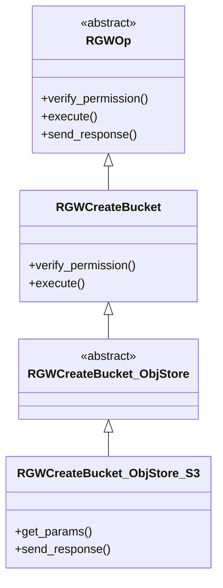
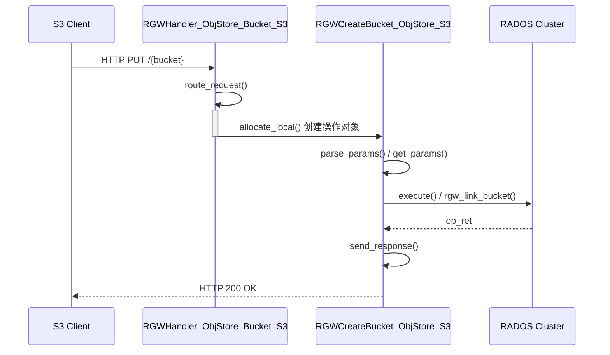

用 S3 命令（s3cmd /awscli/boto3 等）创建的是 RadosBucket（标准对象存储桶）[^8]  
# 1 类继承体系  
- `RGWOp` 是所有RGW操作的**抽象基类**  
- `RGWCreateBucket` 是**直接继承自 `RGWOp` 的第一个子类**，它实现了**创建存储桶的通用核心逻辑**，实现了 `execute()` 函数，该函数内部主要调用了 `rgw_link_bucket` 等底层RADOS接口，执行创建存储桶的实际操作，不关心具体的协议
- `RGWCreateBucket_ObjStore` 继承了 `RGWCreateBucket`，是**从通用操作到具体存储逻辑的桥梁**。它引入**对象存储语义**，将上层请求适配到RGW对象存储模型，负责解析对象存储相关的参数（如存储类、元数据等），并实现执行过程中与对象存储模型相关的逻辑。
- `RGWCreateBucket_ObjStore_S3` 继承了 `RGWCreateBucket_ObjStore`，是**整个继承链的最终环节**，专门负责处理**S3协议**的创建存储桶请求。它实现了S3协议特有的细节，如覆盖 `get_params()` 方法以解析S3请求头，并覆盖 `send_response()` 方法以构造符合S3规范的响应。
```c++
class RGWCreateBucket_ObjStore_S3 : public RGWCreateBucket_ObjStore {
public:
    RGWCreateBucket_ObjStore_S3() {}
    ~RGWCreateBucket_ObjStore_S3() override {}

    int get_params(optional_yield y) override;
    void send_response() override;
};


class RGWCreateBucket_ObjStore : public RGWCreateBucket {
public:
  RGWCreateBucket_ObjStore() {}
  ~RGWCreateBucket_ObjStore() override {}

  virtual std::string canonical_name() const override { return fmt::format("REST.{}.BUCKET", s->info.method); }
};

class RGWCreateBucket : public RGWOp {
    int verify_permission(optional_yield y) override;
    void pre_exec() override;
    void execute(optional_yield y) override;
    void init(rgw::sal::Driver* driver, req_state *s, RGWHandler *h) override {
        RGWOp::init(driver, s, h);
        relaxed_region_enforcement =
        s->cct->_conf.get_val<bool>("rgw_relaxed_region_enforcement");
    }
    virtual int get_params(optional_yield y) { return 0; }
    void send_response() override = 0;
}

// rgw_sal_rados.h
class RadosBucket : public StoreBucket {

}
```

类继承体系：  


# 2 创建整体简要流程  
流程简要时序图：  

## 2.1 通用核心逻辑   
`RGWOp` 是所有RGW操作的**抽象基类**，抽象了**pre_exec、execute、complete**三阶段，其中主体处理逻辑在 `execute`：`RGWCreateBucket::execute(optional_yield y)`  

### 2.1.1 参数检查  
`virtual int get_params(optional_yield y)` 此处是虚函数，处理逻辑与具体协议有关，定义在RGWCreateBucket_ObjStore_S3/RGWCreateBucket_ObjStore_SWIFT等与协议有关的子类中。

### 2.1.3 创建存储桶核心流程
流程图：

 分步描述：  
1. **选择placement**  
`static int select_bucket_placement(...)` //select and validate the placement target

2. **检查是否已经存在待创建的桶**    
    - 加载处理：driver->load_bucket(), 即RadosBucket::load_bucket()  
        - if bucket_id为空，则 `store->ctl()->bucket->read_bucket_info`
            - read_bucket_entrypoint_info()
            - read_bucket_instance_info()
                - do_read_bucket_instance_info
        - 否则：`store->ctl()->bucket->read_bucket_instance_info`
    - 如果存在：获取已存在桶的部分属性作为待创建桶的参数
        - swift_ver_location
        - placement_rule

3. **组装创建桶需要的参数**    
    - zonegroup_id
    - zone_placement
    - swift_ver_location
    - placement_rule
    - owner
    - attrs(不局限于如下两个)
        - RGW_ATTR_ACL
        - RGW_ATTR_CORS
    - quota

4. **检查是否是master zone，如果不是，则优先转发给master创建**
    - rgw_forward_request_to_master()
    - 如下从master获取
        - marker
        - bucket_id
        - zonegroup_id
        - obj_lock_enabled
        - quota
        - creation_time
5. **创建桶并且持久化    
    - 创建bucket:  s->bucket->create(this, createparams, y)
        - RadosBucket::create()  
            - store->get_rados()->create_bucket():  RGWRados::create_bucket(...)
                - 生成版本号： generate_new_write_ver()
                - 创建桶id： create_bucket_id()
                - RGWRados::put_linked_bucket_info()
                    - 元数据持久化 BucketInfo结构：RGWRados::put_bucket_instance_info
                    - ctl.bucket->store_bucket_entrypoint_info()
            - RadosBucket::link()
                - store->ctl()->bucket->link_bucket() - RGWBucketCtl::link_bucket() 
                    - 持久化bucket entrypoint结构： - svc.bucket->store_bucket_entrypoint_info()
            - store->ctl()->bucket->read_bucket_entrypoint_info()

扩展属性（xattrs/attrs）处理 ？
原子提交与返回  ？  

# 3 相关链接  
- [Rgw元数据管理](Rgw元数据管理.md)