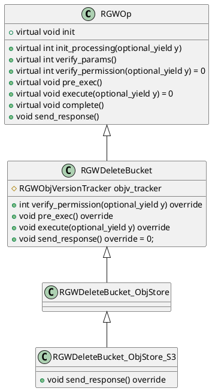
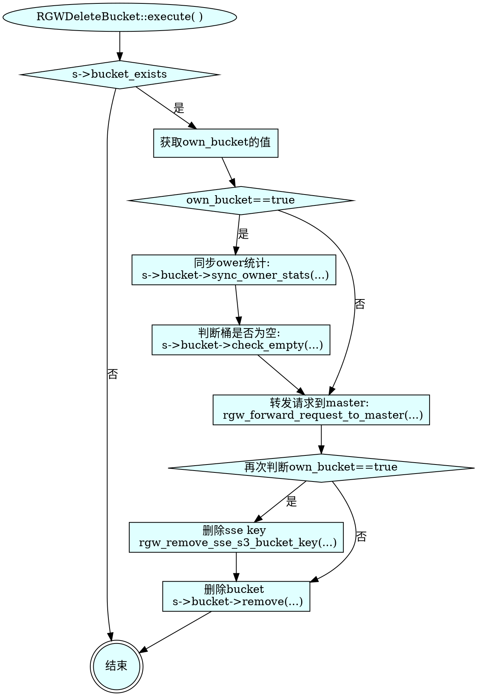

# 1 OP类继承体系  


- `RGWOp` 是所有RGW操作的**抽象基类**  
- `RGWDeleteBucket` 是**直接继承自 `RGWOp` 的第一个子类**，它实现了**删除存储桶的通用核心逻辑**，实现了 `execute()` 函数，不关心具体的协议
- `RGWDeleteBucket_ObjStore` 继承了 `RGWDeleteBucket`，是**从通用操作到具体存储逻辑的桥梁**。它引入**对象存储语义**，将上层请求适配到RGW对象存储模型，负责解析对象存储相关的参数（如存储类、元数据等），并实现执行过程中与对象存储模型相关的逻辑。
- `RGWDeleteBucket_ObjStore_S3` 继承了 `RGWDeleteBucket_ObjStore`，是**整个继承链的最终环节**，专门负责处理**S3协议**的创建存储桶请求。它实现了S3协议特有的细节，如覆盖 `send_response()` 方法以构造符合S3规范的响应。

>  本文只涉及RadosBucket
# 2 整体删除流程梳理
`RGWOp` 是所有RGW操作的**抽象基类**，抽象了**pre_exec、execute、complete**三阶段，其中主体处理逻辑在 `execute`：`RGWDeleteBucket::execute(optional_yield y)`  。  

使用 `s3cmd rb s3://my-bucket` 可以删除空桶
```bash
[root@ceph-221 /]# s3cmd rb s3://my-bucket
Bucket 's3://my-bucket/' removed
```
### 2.1.1 阶段 1:pre_exec   

### 2.1.2 阶段2:核心流程-execute  
#### 2.1.2.1 简要流程图


#### 2.1.2.2 详细分步描述   
1. 判断own_bucket，如果等于true
    - s->bucket->sync_owner_stats(...)
    - s->bucket->check_empty(...)
2. 转发消息到master： `rgw_forward_request_to_master(...)`
3. 如果own_bucket == true：
    - `rgw_remove_sse_s3_bucket_key(...)`
4. 删除bucket：`RadosBucket::remove()`
    - 加载bucket：`RadosBucket::load_bucket(...)`
    - 如果delete_children == true，即删除非空桶，则循环
        - 获取桶中对象： `RadosBucket::list(...)`
        - 删除对象：`rgw_remove_object(...)`
    - 如果own_bucket == true：
        - 放弃分段上传：`RadosBucket::abort_multiparts(...)`
    - remove lifecycle config：`store->getRados()->get_lc()->remove_bucket_config(...)`
    - remove bucket-topic mapping
    - 如果own_bucket == true：
        - 同步owner统计：`store->ctl()->bucket->sync_owner_stats(...)`
    - 删除桶实例信息： `store->getRados()->delete_bucket(...)`:  `RGWRados::delete_bucket(...)`
    - 删除桶entrypoint： `store->ctl()->bucket->unlink_bucket(...)`:  `RGWBucketCtl::unlink_bucket(...)`
### 2.1.3 阶段3:complete  
调用基类的void complete() 函数，最终执行void send_response()，RGWDeleteBucket的send_response() 为纯虚函数 `void send_response() override = 0`，最终需要执行子类的send_response()，比如：`RGWDeleteBucket_ObjStore_S3::send_response(...)` 或者 `RGWDeleteBucket_ObjStore_SWIFT::send_response(...)  

### 疑问  
1. 如何保证原子性