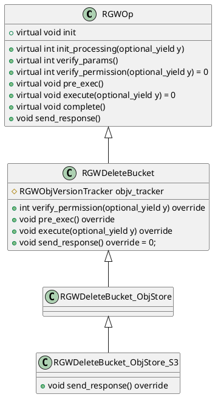

# 1 OP类继承体系  

- `RGWOp` 是所有RGW操作的**抽象基类**  
- `RGWDeleteBucket` 是**直接继承自 `RGWOp` 的第一个子类**，它实现了**删除存储桶的通用核心逻辑**，实现了 `execute()` 函数，不关心具体的协议
- `RGWDeleteBucket_ObjStore` 继承了 `RGWDeleteBucket`，是**从通用操作到具体存储逻辑的桥梁**。它引入**对象存储语义**，将上层请求适配到RGW对象存储模型，负责解析对象存储相关的参数（如存储类、元数据等），并实现执行过程中与对象存储模型相关的逻辑。
- `RGWDeleteBucket_ObjStore_S3` 继承了 `RGWDeleteBucket_ObjStore`，是**整个继承链的最终环节**，专门负责处理**S3协议**的创建存储桶请求。它实现了S3协议特有的细节，如覆盖 `send_response()` 方法以构造符合S3规范的响应。

>  本文只涉及RadosBucket
# 2 整体删除流程梳理
`RGWOp` 是所有RGW操作的**抽象基类**，抽象了**pre_exec、execute、complete**三阶段，其中主体处理逻辑在 `execute`：`RGWDeleteBucket::execute(optional_yield y)`  
### 2.1.1 阶段 1:pre_exec   

### 2.1.2 阶段2:核心流程-execute  

### 2.1.3 阶段3:complete  